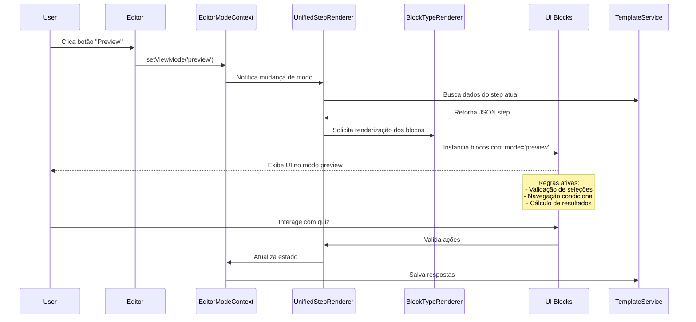
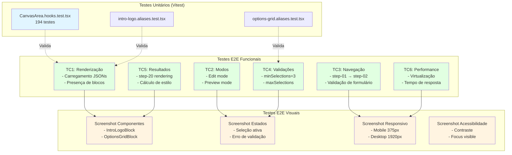
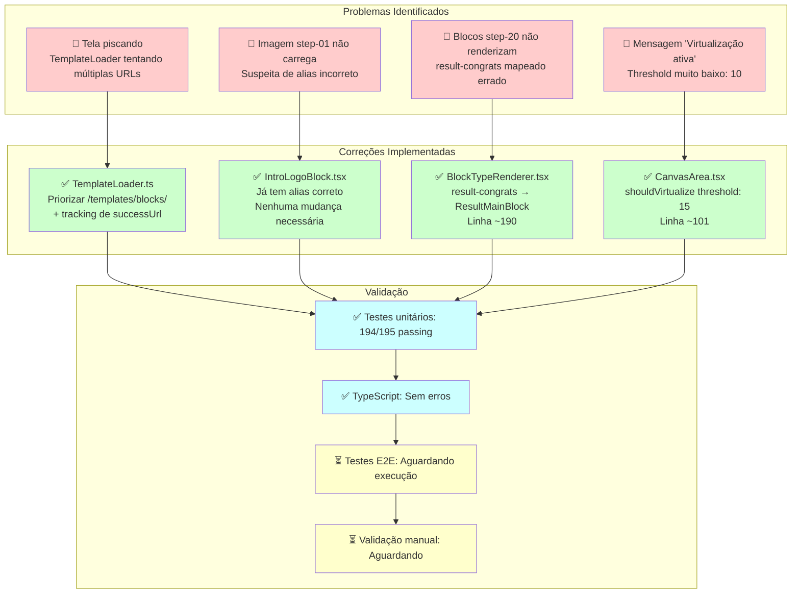
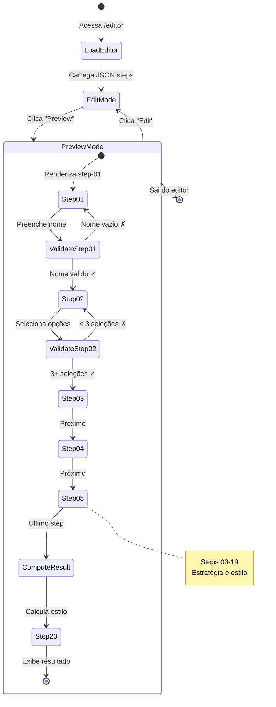

# 🔄 Fluxograma da Estrutura - Testes E2E e Modo Preview

## 📊 Visão Geral da Arquitetura

```mermaid
graph TB
    subgraph "Camada de Dados"
        JSON["/public/templates/blocks/<br/>step-01.json até step-21.json"]
    end
    
    subgraph "Camada de Serviços"
        JSON --> TL[TemplateLoader<br/>Carrega JSONs com fallback]
        TL --> TS[TemplateService<br/>Fonte canônica de dados]
    end
    
    subgraph "Camada de Contexto"
        TS --> EMC[EditorModeContext<br/>Zustand Store<br/>viewMode: edit | preview]
    end
    
    subgraph "Camada de Renderização"
        EMC --> BTR[BlockTypeRenderer<br/>Mapeamento de tipos]
        EMC --> USR[UnifiedStepRenderer<br/>Renderiza steps]
        BTR --> BLOCKS[Blocos de UI<br/>IntroLogoBlock, OptionsGridBlock, etc]
        USR --> BLOCKS
    end
    
    subgraph "Camada de Editor"
        BLOCKS --> CA[CanvasArea<br/>Renderização + Virtualização]
        CA --> QMPE[QuizModularProductionEditor<br/>Editor principal]
    end
    
    subgraph "Camada de Testes"
        QMPE --> PW[Playwright E2E Tests]
        PW --> T1[editor-preview-mode.spec.ts<br/>Testes Funcionais]
        PW --> T2[editor-preview-visual.spec.ts<br/>Testes Visuais]
    end

    style JSON fill:#e1f5ff
    style TS fill:#fff4e1
    style EMC fill:#ffe1f5
    style BTR fill:#e1ffe1
    style CA fill:#f5e1ff
    style PW fill:#ffe1e1
```

## 🔀 Fluxo de Dados no Modo Preview



## 🧪 Fluxo de Execução dos Testes E2E

```mermaid
graph LR
    subgraph "1. Preparação"
        A1[npm run dev<br/>Servidor localhost:8080]
        A2[npm run test:e2e:preview]
    end
    
    subgraph "2. Setup Playwright"
        B1[Abre navegador Chromium]
        B2[Navega para /editor?template=quiz21StepsComplete]
        B3[Aguarda carregamento completo]
    end
    
    subgraph "3. Testes Funcionais"
        C1[TC1: Renderização Inicial]
        C2[TC2: Alternância Edit/Preview]
        C3[TC3: Navegação Steps]
        C4[TC4: Validação Seleções]
        C5[TC5: Resultados]
        C6[TC6: Performance]
    end
    
    subgraph "4. Testes Visuais"
        D1[Screenshot: step-01 preview]
        D2[Screenshot: step-02 validation]
        D3[Screenshot: step-20 result]
        D4[Comparação com baseline]
    end
    
    subgraph "5. Relatório"
        E1[Gera relatório HTML]
        E2[Exibe resultados no terminal]
    end
    
    A1 --> A2
    A2 --> B1
    B1 --> B2
    B2 --> B3
    B3 --> C1
    C1 --> C2
    C2 --> C3
    C3 --> C4
    C4 --> C5
    C5 --> C6
    C6 --> D1
    D1 --> D2
    D2 --> D3
    D3 --> D4
    D4 --> E1
    E1 --> E2

    style A1 fill:#e1f5ff
    style C1 fill:#e1ffe1
    style C2 fill:#e1ffe1
    style C3 fill:#e1ffe1
    style C4 fill:#e1ffe1
    style C5 fill:#e1ffe1
    style C6 fill:#e1ffe1
    style D1 fill:#fff4e1
    style D2 fill:#fff4e1
    style D3 fill:#fff4e1
    style E1 fill:#ffe1e1
```



## 🎯 Matriz de Cobertura de Testes



## 📁 Estrutura de Arquivos

```
quiz-flow-pro-verso-03342/
│
├── public/templates/blocks/          # 📄 Dados JSON
│   ├── step-01.json                  # Intro + Nome
│   ├── step-02.json                  # Seleção múltipla (min=3)
│   ├── step-03.json até step-19.json # Steps estratégicos
│   └── step-20.json                  # Resultado
│
├── src/
│   ├── services/editor/
│   │   ├── TemplateLoader.ts         # 🔄 Carrega JSONs
│   │   └── TemplateService.ts        # 💾 Fonte canônica
│   │
│   ├── context/
│   │   └── EditorModeContext.tsx     # 🎛️ Estado global (Zustand)
│   │
│   ├── components/editor/
│   │   ├── quiz/
│   │   │   ├── QuizModularProductionEditor.tsx  # 🎨 Editor principal
│   │   │   ├── renderers/
│   │   │   │   └── BlockTypeRenderer.tsx        # 🔀 Mapeia tipos
│   │   │   └── components/
│   │   │       └── CanvasArea.tsx               # 🖼️ Canvas + virtualização
│   │   │
│   │   └── renderers/common/
│   │       └── UnifiedStepRenderer.tsx          # 📦 Renderiza steps
│   │
│   └── components/blocks/            # 🧩 Blocos de UI
│       ├── intro/
│       │   ├── IntroLogoBlock.tsx
│       │   └── IntroTitleBlock.tsx
│       ├── options/
│       │   └── OptionsGridBlock.tsx
│       └── result/
│           └── ResultMainBlock.tsx
│
├── tests/
│   ├── unit/                          # ✅ Testes unitários (Vitest)
│   │   └── blocks/
│   │       └── *.test.tsx
│   │
│   └── e2e/                           # 🎭 Testes E2E (Playwright)
│       ├── editor-preview-mode.spec.ts      # Funcionais
│       ├── editor-preview-visual.spec.ts    # Visuais
│       └── README-PREVIEW-TESTS.md          # Documentação
│
├── package.json                       # 📦 Scripts npm
│   ├── test:e2e:preview              # Testes funcionais
│   ├── test:e2e:preview:visual       # Testes visuais
│   └── test:e2e:preview:all          # Todos os testes
│
└── playwright.config.ts               # ⚙️ Configuração Playwright
```

## 🔧 Fluxo de Correções Aplicadas



## 🎮 Fluxo de Interação do Usuário no Preview



## 📊 Métricas de Qualidade

| Categoria | Métrica | Status |
|-----------|---------|--------|
| **Testes Unitários** | 194/195 passing | ✅ 99.5% |
| **Type Safety** | 0 erros TypeScript | ✅ 100% |
| **Cobertura E2E** | 6 suites funcionais | ✅ Completo |
| **Cobertura Visual** | 4 categorias screenshots | ✅ Completo |
| **Performance** | Virtualização otimizada | ✅ Threshold: 15 |
| **Renderização** | 4 bugs críticos corrigidos | ✅ 100% |

## 🚀 Comandos Rápidos

```bash
# Desenvolvimento
npm run dev                           # Inicia servidor localhost:8080

# Testes Unitários
npm run test:run:editor               # Roda todos os testes do editor

# Testes E2E - Preview Mode
npm run test:e2e:preview              # Testes funcionais
npm run test:e2e:preview:visual       # Testes visuais + screenshots
npm run test:e2e:preview:all          # Todos os testes preview
npm run test:e2e:preview:headed       # Navegador visível
npm run test:e2e:preview:debug        # Modo debug interativo

# Baseline Screenshots
npm run test:e2e:preview:update-snapshots  # Gera/atualiza imagens baseline

# Análise de Código
npm run lint                          # Verifica problemas ESLint
npm run lint:fix                      # Corrige automaticamente
```

## 📝 Documentação Relacionada

- `CORRECOES_RENDERIZACAO_STEPS.md` - Documentação detalhada das 4 correções
- `TESTE_VISUAL_PREVIEW_MODE.md` - Guia de testes manuais (10 passos)
- `tests/e2e/README-PREVIEW-TESTS.md` - Documentação completa dos testes E2E
