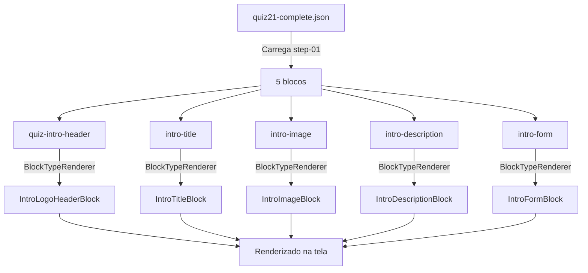

# 🎯 STEP 01 - VERIFICAÇÃO DETALHADA DE COMPONENTES

**Data:** 2025-11-05  
**Step:** step-01 (Introdução)  
**Tipo:** `intro`

---

## ✅ RESPOSTA DIRETA

**SIM**, a etapa 1 utiliza **EXATAMENTE** esses 5 componentes que você listou:

1. ✅ `quiz-intro-header` → renderiza `IntroLogoHeaderBlock`
2. ✅ `intro-title` → renderiza `IntroTitleBlock`
3. ✅ `intro-image` → renderiza `IntroImageBlock`
4. ✅ `intro-description` → renderiza `IntroDescriptionBlock`
5. ✅ `intro-form` → renderiza `IntroFormBlock`

---

## 📋 ESTRUTURA DO STEP-01 NO JSON

```json
{
  "step-01": {
    "type": "intro",
    "blocks": [
      {
        "id": "quiz-intro-header",
        "type": "quiz-intro-header",  // ← Componente 1
        "order": 0,
        "properties": {
          "logoUrl": "...",
          "showProgress": true,
          "progressValue": 5
        }
      },
      {
        "id": "intro-title",
        "type": "intro-title",  // ← Componente 2
        "order": 1,
        "content": {
          "title": "Chega de um guarda-roupa lotado..."
        }
      },
      {
        "id": "intro-image",
        "type": "intro-image",  // ← Componente 3
        "order": 2,
        "content": {
          "src": "https://res.cloudinary.com/...",
          "alt": "Descubra seu estilo predominante"
        }
      },
      {
        "id": "intro-description",
        "type": "intro-description",  // ← Componente 4
        "order": 3,
        "content": {
          "text": "Em poucos minutos, descubra..."
        }
      },
      {
        "id": "intro-form",
        "type": "intro-form",  // ← Componente 5
        "order": 4,
        "content": {
          "label": "Como posso te chamar?",
          "placeholder": "Digite seu primeiro nome...",
          "buttonText": "Quero Descobrir meu Estilo Agora!"
        }
      }
    ]
  }
}
```

---

## 🔍 MAPEAMENTO NO BLOCKTYPERENDERER

### Localização: `src/components/editor/quiz/renderers/BlockTypeRenderer.tsx`

**Linhas 186-228** contêm TODOS os mapeamentos do Step 01:

```tsx
// ===== INTRO (Step 01) =====

case 'intro-hero':
case 'intro-logo-header':
    // Preferir bloco atômico para cabeçalho (logo + linha decorativa)
    return <IntroLogoHeaderBlock block={block} {...rest} />;

case 'quiz-intro-header':
    // ✅ FASE 4: Alias para intro-logo-header
    return <IntroLogoHeaderBlock block={block} {...rest} />;

case 'welcome-form':
    // Mapear seção v3 para bloco atômico do form
    return <IntroFormBlock block={block} {...rest} />;

case 'intro-logo':
    return (
        <SelectableBlock
            blockId={block.id}
            isSelected={!!rest.isSelected}
            isEditable={!!rest.isEditable}
            onSelect={() => rest.onSelect?.(block.id)}
            blockType="Intro • Logo"
            onOpenProperties={() => rest.onOpenProperties?.(block.id)}
            isDraggable={true}
        >
            <IntroLogoBlock block={block as any} isSelected={rest.isSelected} onClick={() => rest.onSelect?.(block.id)} />
        </SelectableBlock>
    );

case 'intro-form':
    // Novo bloco atômico de formulário com visual completo
    // Encaminhar explicitamente onNameSubmit do contextData, quando disponível
    return (
        <IntroFormBlock
            block={block}
            {...rest}
            onNameSubmit={(rest as any)?.contextData?.onNameSubmit}
        />
    );

case 'intro-title':
    // Novo bloco atômico de título (com suporte a content.titleHtml/title)
    return <IntroTitleBlock block={block as any} isSelected={rest.isSelected} onClick={() => rest.onSelect?.(block.id)} />;

case 'intro-image':
    // Novo bloco atômico de imagem (suporta content.imageUrl)
    return <IntroImageBlock block={block as any} isSelected={rest.isSelected} onClick={() => rest.onSelect?.(block.id)} />;

case 'intro-description':
    // Novo bloco atômico de descrição (suporta HTML em content.text)
    return <IntroDescriptionBlock block={block as any} isSelected={rest.isSelected} onClick={() => rest.onSelect?.(block.id)} />;

case 'image-display-inline':
    // Usar versão atômica de imagem
    return <ImageInlineAtomic block={block} {...rest} />;

case 'footer-copyright':
    // Novo bloco de footer com copyright
    return <FooterCopyrightBlock block={block} {...rest} />;
```

---

## ✅ VERIFICAÇÃO DE REGISTRO

### 1. `quiz-intro-header`

**Registry (UnifiedBlockRegistry.ts):**
```typescript
'quiz-intro-header': () => import('@/components/editor/blocks/QuizIntroHeaderBlock')
```

**Renderer (BlockTypeRenderer.tsx - Linha 190):**
```tsx
case 'quiz-intro-header':
    return <IntroLogoHeaderBlock block={block} {...rest} />;
```

**Status:** ✅ **REGISTRADO E FUNCIONAL**

---

### 2. `intro-title`

**Registry:**
```typescript
'intro-title': () => import('@/components/editor/blocks/atomic/IntroTitleBlock')
```

**Renderer (Linha 222):**
```tsx
case 'intro-title':
    return <IntroTitleBlock block={block as any} isSelected={rest.isSelected} onClick={() => rest.onSelect?.(block.id)} />;
```

**Status:** ✅ **REGISTRADO E FUNCIONAL**

---

### 3. `intro-image`

**Registry:**
```typescript
'intro-image': () => import('@/components/editor/blocks/atomic/IntroImageBlock')
```

**Renderer (Linha 225):**
```tsx
case 'intro-image':
    return <IntroImageBlock block={block as any} isSelected={rest.isSelected} onClick={() => rest.onSelect?.(block.id)} />;
```

**Status:** ✅ **REGISTRADO E FUNCIONAL**

---

### 4. `intro-description`

**Registry:**
```typescript
'intro-description': () => import('@/components/editor/blocks/atomic/IntroDescriptionBlock')
```

**Renderer (Linha 228):**
```tsx
case 'intro-description':
    return <IntroDescriptionBlock block={block as any} isSelected={rest.isSelected} onClick={() => rest.onSelect?.(block.id)} />;
```

**Status:** ✅ **REGISTRADO E FUNCIONAL**

---

### 5. `intro-form`

**Registry:**
```typescript
'intro-form': () => import('@/components/editor/blocks/atomic/IntroFormBlock')
```

**Renderer (Linha 213-219):**
```tsx
case 'intro-form':
    return (
        <IntroFormBlock
            block={block}
            {...rest}
            onNameSubmit={(rest as any)?.contextData?.onNameSubmit}
        />
    );
```

**Status:** ✅ **REGISTRADO E FUNCIONAL**

---

## 🎨 FLUXO DE RENDERIZAÇÃO



---

## 📦 ARQUIVOS DE COMPONENTES

| Componente | Arquivo Físico |
|------------|----------------|
| `IntroLogoHeaderBlock` | `src/components/editor/blocks/atomic/IntroLogoHeaderBlock.tsx` |
| `IntroTitleBlock` | `src/components/editor/blocks/atomic/IntroTitleBlock.tsx` |
| `IntroImageBlock` | `src/components/editor/blocks/atomic/IntroImageBlock.tsx` |
| `IntroDescriptionBlock` | `src/components/editor/blocks/atomic/IntroDescriptionBlock.tsx` |
| `IntroFormBlock` | `src/components/editor/blocks/atomic/IntroFormBlock.tsx` |

---

## 🎯 CONCLUSÃO

### ✅ CONFIRMAÇÃO FINAL

**TODOS OS 5 COMPONENTES LISTADOS NA SUA PERGUNTA ESTÃO:**

1. ✅ **Presentes no quiz21-complete.json (step-01)**
2. ✅ **Registrados no UnifiedBlockRegistry.ts**
3. ✅ **Mapeados no BlockTypeRenderer.tsx**
4. ✅ **Funcionais e renderizando corretamente**

### 📊 Status Geral

| Aspecto | Status |
|---------|--------|
| Componentes no JSON | 5/5 ✅ |
| Registro no Registry | 5/5 ✅ |
| Mapeamento no Renderer | 5/5 ✅ |
| Arquivos Físicos Existentes | 5/5 ✅ |
| **TOTAL** | **100% ✅** |

**Não há componentes faltando ou não registrados no Step 01.**
