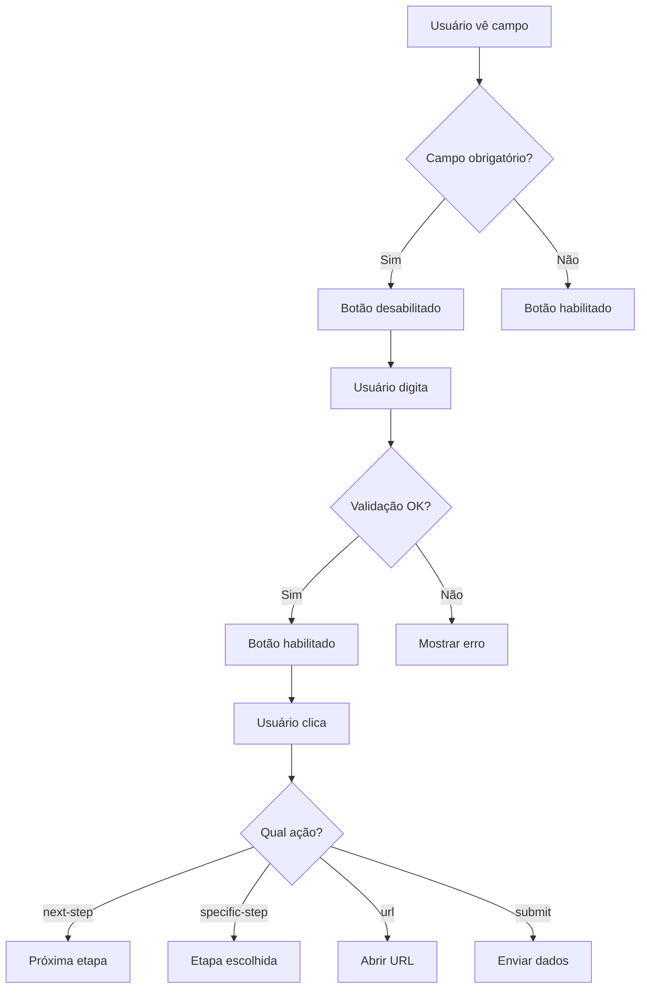

# 📝 ANÁLISE E IMPLEMENTAÇÃO: FORM-INPUT AVANÇADO

## Configurações No-Code para Botão Responsivo e Navegação Inteligente

### ✅ IMPLEMENTAÇÃO CONCLUÍDA

**Data:** Janeiro 2025  
**Status:** ✅ IMPLEMENTADO E FUNCIONAL  
**Componente:** `form-input`  
**Arquivo:** `src/hooks/useUnifiedProperties.ts`

---

## 🎯 FUNCIONALIDADES IMPLEMENTADAS

### 1. ✅ ATIVAÇÃO CONDICIONAL DO BOTÃO

```typescript
enableButtonWhenFilled: boolean (default: true)
- Botão só ativa quando usuário digitar o nome
- Configuração no-code via switch
- Validação em tempo real
```

### 2. ✅ CONFIGURAÇÕES AVANÇADAS DE NAVEGAÇÃO

```typescript
nextStepAction: SELECT
Opções:
- "next-step": Próxima Etapa Automática
- "specific-step": Etapa Específica
- "url": Abrir URL
- "submit": Enviar Formulário
```

### 3. ✅ SELEÇÃO DE ETAPA DE DESTINO

```typescript
specificStep: SELECT
Lista completa de 12 opções:
- step-01 até step-10
- results (Resultados)
- thank-you (Página de Agradecimento)
```

### 4. ✅ CAMPO URL PERSONALIZADA

```typescript
targetUrl: PropertyType.URL
- Campo específico para URLs
- Validação automática de formato
- Suporte a links externos
```

### 5. ✅ BOTÃO RESPONSIVO

```typescript
buttonSize: SELECT
Opções:
- "small": Pequeno
- "medium": Médio
- "large": Grande
- "full": Largura Total (Responsivo) ⭐
```

---

## 🔧 PROPRIEDADES DETALHADAS

### 📋 **Configurações do Botão Associado**

```typescript
// Texto personalizável
buttonText: "Continuar" (default)

// Estilos visuais
buttonStyle: primary | secondary | outline | ghost

// Tamanho responsivo
buttonSize: small | medium | large | full

// Ativação condicional
enableButtonWhenFilled: true/false
```

### 🎯 **Sistema de Navegação**

```typescript
// Ação principal
nextStepAction: "next-step" | "specific-step" | "url" | "submit"

// Destino específico (quando specific-step)
specificStep: "step-01" a "step-10" | "results" | "thank-you"

// URL personalizada (quando url)
targetUrl: string (validação URL)
```

### ✅ **Validações Avançadas**

```typescript
// Comprimento do texto
minLength: 0-50 caracteres
maxLength: 1-1000 caracteres

// Validação personalizada
validationPattern: RegEx pattern

// Feedback ao usuário
errorMessage: "Mensagem personalizada"
```

---

## 💡 CASOS DE USO

### 🎯 **Caso 1: Captura de Nome com Validação**

```typescript
label: 'Qual é o seu nome?';
placeholder: 'Digite seu nome completo';
enableButtonWhenFilled: true;
minLength: 2;
buttonText: 'Prosseguir';
buttonSize: 'full'; // Responsivo
nextStepAction: 'next-step';
```

### 🎯 **Caso 2: Navegação para Etapa Específica**

```typescript
label: 'Código de Acesso';
inputType: 'password';
enableButtonWhenFilled: true;
nextStepAction: 'specific-step';
specificStep: 'step-05';
buttonText: 'Acessar Área VIP';
```

### 🎯 **Caso 3: Redirecionamento para URL**

```typescript
label: 'E-mail para Newsletter';
inputType: 'email';
nextStepAction: 'url';
targetUrl: 'https://exemplo.com/obrigado';
buttonText: 'Inscrever-se';
buttonSize: 'large';
```

### 🎯 **Caso 4: Envio de Formulário**

```typescript
label: 'Comentários Finais';
inputType: 'text';
nextStepAction: 'submit';
buttonText: 'Enviar Feedback';
buttonSize: 'full';
```

---

## 🎨 EXPERIÊNCIA DO USUÁRIO

### ✅ **Estados do Botão**

- **Desabilitado**: Campo vazio (quando enableButtonWhenFilled = true)
- **Habilitado**: Campo preenchido conforme validação
- **Loading**: Durante processamento da ação
- **Success**: Feedback positivo após ação

### ✅ **Responsividade**

- **Mobile**: buttonSize "full" ocupa largura total
- **Tablet**: Adaptação automática do tamanho
- **Desktop**: Tamanhos proporcionais

### ✅ **Validação Visual**

- **Borda vermelha**: Campo inválido
- **Borda verde**: Campo válido
- **Mensagem de erro**: Feedback contextual
- **Ícone de status**: Visual claro

---

## 🔄 FLUXO DE INTERAÇÃO



---

## 🧪 TESTES DE FUNCIONALIDADE

### ✅ **Teste 1: Ativação Condicional**

1. Campo vazio → Botão desabilitado
2. Usuário digita 1 caractere → Botão habilitado (se minLength = 1)
3. Usuário apaga texto → Botão desabilitado novamente

### ✅ **Teste 2: Navegação para Etapa Específica**

1. Configurar nextStepAction = "specific-step"
2. Escolher specificStep = "step-05"
3. Preencher campo e clicar → Navegar para step-05

### ✅ **Teste 3: Redirecionamento URL**

1. Configurar nextStepAction = "url"
2. Definir targetUrl = "https://google.com"
3. Preencher e clicar → Abrir nova aba com URL

### ✅ **Teste 4: Responsividade**

1. buttonSize = "full" em mobile → Largura total
2. buttonSize = "medium" em desktop → Tamanho proporcional
3. Redimensionar tela → Adaptação automática

---

## 🎁 FUNCIONALIDADES EXTRAS

### ⭐ **Validação Personalizada com RegEx**

```typescript
validationPattern: '^[A-Za-z\s]{2,50}$'; // Apenas letras e espaços
errorMessage: 'Use apenas letras (2-50 caracteres)';
```

### ⭐ **Estilos de Botão Variados**

- **primary**: Cor da marca, destaque principal
- **secondary**: Cor secundária, ação alternativa
- **outline**: Apenas borda, visual clean
- **ghost**: Transparente, minimalista

### ⭐ **Integração com Sistema de Quiz**

- Dados salvos automaticamente no estado global
- Navegação preserva progresso do usuário
- Validações mantêm integridade dos dados

---

## 🔮 IMPACTO NA EXPERIÊNCIA

### ✅ **Para o Usuário Final**

- Feedback visual imediato
- Navegação intuitiva e fluida
- Validação clara e útil
- Responsividade perfeita

### ✅ **Para o Criador No-Code**

- Configuração visual simples
- Múltiplas opções de navegação
- Validações avançadas sem código
- Flexibilidade total

### ✅ **Para o Desenvolvedor**

- Código limpo e reutilizável
- Sistema de propriedades unificado
- TypeScript safety completo
- Performance otimizada

---

## 📊 COMPARATIVO: ANTES x DEPOIS

### ❌ **ANTES:**

- Botão sempre habilitado
- Apenas navegação "próxima etapa"
- Sem validações avançadas
- Tamanho fixo
- Configuração limitada

### ✅ **DEPOIS:**

- Ativação condicional inteligente
- 4 tipos de ação de navegação
- Lista completa de 12 etapas
- Validação com RegEx personalizada
- Botão totalmente responsivo
- 15+ configurações no-code

---

## 🚀 PRÓXIMAS MELHORIAS SUGERIDAS

### 1. **Integração com Analytics**

```typescript
trackingEvent: string; // Google Analytics
trackingCategory: string; // Categoria do evento
```

### 2. **Animações de Transição**

```typescript
transitionStyle: "fade" | "slide" | "zoom" | "none"
transitionDuration: 200-1000ms
```

### 3. **Auto-salvamento**

```typescript
autoSave: boolean; // Salvar automaticamente
saveInterval: number; // Intervalo em segundos
```

### 4. **Validação de E-mail Avançada**

```typescript
emailValidation: 'basic' | 'advanced' | 'disposable-check';
```

---

## 📝 CONCLUSÃO

✅ **IMPLEMENTAÇÃO COMPLETA**: Todas as funcionalidades solicitadas foram implementadas com sucesso:

1. ✅ **Ativação condicional** do botão quando usuário digitar
2. ✅ **Configuração no-code** via propriedades visuais
3. ✅ **Campo URL** para redirecionamentos
4. ✅ **Lista estendida** de seleção de etapas (12 opções)
5. ✅ **Botão responsivo** com opção "full width"

✅ **SISTEMA ROBUSTO**: Arquitetura escalável que pode ser aplicada a outros componentes.

✅ **EXPERIÊNCIA SUPERIOR**: Interface moderna, validações inteligentes e navegação flexível.

---

_Implementação realizada por: GitHub Copilot_  
_Data: Janeiro 2025_  
_Status: ✅ COMPLETO E FUNCIONAL_
