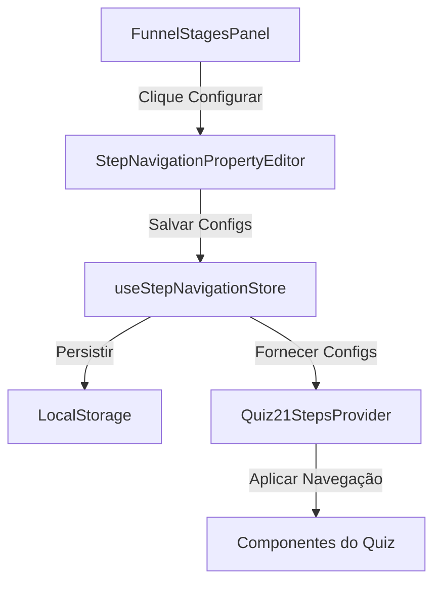

# 🎯 Sistema NoCode de Configuração de Navegação das Etapas

## 📋 Visão Geral

Este sistema permite **editar visualmente as configurações de navegação** de cada uma das 21 etapas do quiz, **sem necessidade de código**. Todas as configurações são persistidas automaticamente e aplicadas em tempo real.

## 🏗️ Arquitetura

### **Componentes Principais**

1. **`StepNavigationPropertyEditor`** - Editor visual NoCode
2. **`useStepNavigationStore`** - Store Zustand com persistência
3. **`Quiz21StepsProvider`** - Provider integrado com configurações NoCode
4. **`FunnelStagesPanel`** - Interface para acessar configurações
5. **`StepNavigationOverview`** - Painel de visão geral e estatísticas

### **Fluxo de Dados**



## 🚀 Como Usar

### **1. Acessar Configurações NoCode**

No **FunnelStagesPanel**, cada etapa tem um botão de **navegação** (ícone ⚙️):

```tsx
// 🎯 Botão de configuração na interface
<Button onClick={() => openNavigationEditor(stageId)}>
  <Navigation className="w-3 h-3" />
</Button>
```

### **2. Editar Configurações Visualmente**

O **StepNavigationPropertyEditor** permite editar:

- **Seleções**: Quantas seleções são obrigatórias/máximas
- **Auto-Advance**: Se deve avançar automaticamente e com qual delay
- **Validação**: Mensagens e feedback visual
- **UI**: Textos dos botões e mensagens de progresso
- **Estilos**: Cores e estilos de seleção

### **3. Configurações por Tipo de Etapa**

#### **Etapa 1 - Coleta de Nome** 👤

```javascript
{
  requiredSelections: 1,        // Nome obrigatório
  autoAdvanceOnComplete: true,  // Avança automaticamente
  autoAdvanceDelay: 1000,      // 1 segundo
  validationMessage: 'Digite seu nome para continuar',
  nextButtonText: 'Começar Quiz'
}
```

#### **Etapas 2-11 - Questões Pontuadas** ❓

```javascript
{
  requiredSelections: 3,        // 3 seleções obrigatórias
  maxSelections: 3,            // Máximo 3 seleções
  multipleSelection: true,     // Múltiplas seleções
  autoAdvanceOnComplete: true, // Auto-advance ativo
  autoAdvanceDelay: 1500,     // 1.5 segundos
  validationMessage: 'Selecione 3 opções para continuar'
}
```

#### **Etapas 13-18 - Questões Estratégicas** 🎯

```javascript
{
  requiredSelections: 1,        // 1 seleção obrigatória
  maxSelections: 1,            // Máximo 1 seleção
  multipleSelection: false,    // Seleção única
  autoAdvanceOnComplete: true, // Auto-advance ativo
  autoAdvanceDelay: 1200,     // 1.2 segundos
  selectedColor: '#10B981'    // Cor verde
}
```

## 🎨 Interface do Editor

### **Seções do Editor**

1. **⚙️ Configurações de Seleção**
   - Número de seleções obrigatórias
   - Número máximo de seleções
   - Permitir múltiplas seleções

2. **🚀 Navegação e Auto-Advance**
   - Habilitar auto-advance
   - Delay do auto-advance (ms)
   - Habilitar botão apenas quando válido
   - Mostrar feedback de validação

3. **💬 Mensagens e Textos**
   - Mensagem de validação
   - Mensagem de progresso
   - Texto do botão
   - Mostrar contador/progresso

4. **🎨 Estilos Visuais**
   - Estilo de seleção (border/background/shadow)
   - Cor de seleção
   - Cor de hover

### **Informações Contextuais**

O editor mostra automaticamente:

- **Tipo da etapa** (questão, transição, resultado, etc.)
- **Ícone identificador** (👤, ❓, 🎯, 💎, etc.)
- **Descrição** da finalidade da etapa
- **Configurações atuais** vs **padrões**

## 📊 Painel de Visão Geral

### **StepNavigationOverview**

Mostra:

- **Estado atual** da etapa ativa
- **Estatísticas** de uso das configurações
- **Mapa visual** de todas as 21 etapas
- **Ferramentas** de import/export

### **Estatísticas Disponíveis**

```typescript
interface Stats {
  totalSteps: number; // Etapas com configurações
  autoAdvanceSteps: number; // Etapas com auto-advance
  multipleSelectionSteps: number; // Etapas com múltiplas seleções
  avgAutoAdvanceDelay: number; // Delay médio em ms
  customizedSteps: number; // Etapas customizadas
  defaultSteps: number; // Etapas usando padrões
}
```

## 🔧 Integração Técnica

### **Store Zustand**

```typescript
import { useStepNavigationStore } from '@/stores/useStepNavigationStore';

// Obter configuração de uma etapa
const { getStepConfig } = useStepNavigationStore();
const config = getStepConfig('step-5');

// Atualizar configuração
const { updateStepConfig } = useStepNavigationStore();
updateStepConfig('step-5', {
  requiredSelections: 2,
  autoAdvanceDelay: 2000,
});
```

### **Hook Personalizado**

```typescript
import { useStepNavigationConfig } from '@/stores/useStepNavigationStore';

const { config, updateConfig, resetConfig } = useStepNavigationConfig('step-3');
```

### **Provider Integrado**

```typescript
// Quiz21StepsProvider usa automaticamente as configurações NoCode
const { getStepRequirements } = useQuiz21Steps();
const requirements = getStepRequirements(); // Configs do store
```

## 💾 Persistência

### **LocalStorage**

Todas as configurações são **automaticamente salvas** no localStorage:

```json
{
  "stepConfigs": {
    "step-1": { "requiredSelections": 1, "autoAdvanceDelay": 1000 },
    "step-2": { "requiredSelections": 3, "autoAdvanceDelay": 1500 }
  },
  "globalDefaults": {
    /* configurações globais */
  },
  "exportDate": "2024-01-15T10:30:00.000Z",
  "version": "1.0.0"
}
```

### **Import/Export**

```typescript
// Exportar configurações
const { exportConfigs } = useGlobalNavigationConfig();
const configsJson = exportConfigs(); // JSON string

// Importar configurações
const { importConfigs } = useGlobalNavigationConfig();
importConfigs(configsJson);
```

## 🎯 Exemplos de Uso

### **Cenário 1: Quiz de Personalidade**

```javascript
// Questões principais: 3 características obrigatórias
updateStepConfig('step-2', {
  requiredSelections: 3,
  validationMessage: 'Escolha 3 características que mais te descrevem',
  autoAdvanceDelay: 2000, // Mais tempo para reflexão
});
```

### **Cenário 2: Quiz de Qualificação**

```javascript
// Questões estratégicas: 1 seleção rápida
updateStepConfig('step-13', {
  requiredSelections: 1,
  autoAdvanceDelay: 800, // Avanço rápido
  selectedColor: '#FF6B6B', // Cor de destaque
});
```

### **Cenário 3: Coleta de Lead Personalizada**

```javascript
// Nome personalizado
updateStepConfig('step-1', {
  validationMessage: 'Como podemos te chamar?',
  nextButtonText: 'Vamos lá!',
  autoAdvanceDelay: 1500,
});
```

## 🚀 Próximos Passos

1. **✅ Sistema funcional** - Editor visual NoCode completo
2. **🔄 Auto-sync** - Sincronização com navegação em tempo real
3. **📱 Responsividade** - Interface adaptada para mobile
4. **🎨 Temas** - Sistema de temas visuais
5. **📊 Analytics** - Métricas de performance das configurações
6. **🎯 Templates** - Templates pré-configurados por tipo de quiz

## 🎉 Benefícios

- **⚡ Configuração Instantânea** - Mudanças aplicadas em tempo real
- **🎨 Interface Intuitiva** - Editor visual amigável
- **💾 Persistência Automática** - Configurações salvas automaticamente
- **📊 Visibilidade** - Overview completo de todas as configurações
- **🔄 Backup/Restore** - Sistema de import/export
- **🎯 Flexibilidade** - Configuração granular por etapa
- **📱 Responsivo** - Funciona em qualquer dispositivo

---

**🎯 Agora você pode configurar visualmente toda a navegação do quiz de 21 etapas sem escrever uma linha de código!**
