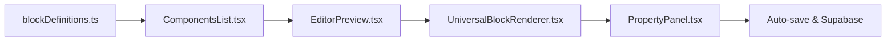

# �️ MECÂNICA COMPLETA DOS COMPONENTES NO /EDITOR

## 🎯 **VISÃO GERAL TÉCNICA**

Esta documentação explica **exatamente como os componentes funcionam no `/editor`** - desde a definição no `blockDefinitions.ts` até a renderização final no editor visual.

## 🔧 **FLUXO COMPLETO DE FUNCIONAMENTO**

### **1. DEFINIÇÃO → REGISTRO → RENDERIZAÇÃO → EDIÇÃO**



### **2. ESTRUTURA TÉCNICA OBRIGATÓRIA**

```typescript
// CADA COMPONENTE PRECISA DESTA ESTRUTURA EXATA:
interface BlockDefinition {
  type: string; // ID único - OBRIGATÓRIO
  name: string; // Nome no painel lateral - OBRIGATÓRIO
  description: string; // Tooltip explicativo - OBRIGATÓRIO
  icon: string; // Ícone Lucide React - OBRIGATÓRIO
  category: string; // Categoria de agrupamento - OBRIGATÓRIO
  propertiesSchema: PropertySchema[]; // Schema de propriedades - OBRIGATÓRIO
  defaultProperties: Record<string, any>; // Valores padrão - OBRIGATÓRIO
}
```

## 🎭 **MECÂNICA DE RENDERIZAÇÃO NO EDITOR**

### **ETAPA 1: ComponentsList.tsx - Painel Lateral**

```typescript
// 1. BUSCA todos os componentes por categoria
const quizBlocks = getBlocksByCategory('Quiz');
const contentBlocks = getBlocksByCategory('content');
const inlineBlocks = getBlocksByCategory('inline');

// 2. RENDERIZA cada item clicável
{quizBlocks.map(blockDef => (
  <div
    key={blockDef.type}
    onClick={() => addBlock(blockDef.type)} // ← CRIA NOVO BLOCO
    className="component-item"
  >
    <Icon name={blockDef.icon} />        // ← ÍCONE do blockDefinitions
    <span>{blockDef.name}</span>         // ← NOME do blockDefinitions
    <Tooltip>{blockDef.description}</Tooltip> // ← DESCRIÇÃO
  </div>
))}
```

### **ETAPA 2: EditorPreview.tsx - Canvas Principal**

```typescript
// 1. RECEBE lista de blocos ativos
const [blocks, setBlocks] = useState<BlockData[]>([]);

// 2. RENDERIZA cada bloco através do UniversalBlockRenderer
{blocks.map(block => (
  <SortableItem key={block.id}>
    <UniversalBlockRenderer
      block={block}                    // ← DADOS do bloco
      isSelected={selectedBlockId === block.id}
      onClick={() => selectBlock(block.id)}
      onSaveInline={handleBlockUpdate} // ← CALLBACK para salvar
    />
  </SortableItem>
))}

// 3. ADICIONAR novo bloco (quando clica no ComponentsList)
const addBlock = (type: string) => {
  const newBlock = createDefaultBlock(type); // ← USA blockDefinitions
  setBlocks([...blocks, newBlock]);
};
```

### **ETAPA 3: UniversalBlockRenderer.tsx - Renderizador Universal**

```typescript
// SWITCH GIGANTE que mapeia type → Componente React
const UniversalBlockRenderer = ({ block, isSelected, onClick, onSaveInline }) => {

  switch (block.type) {
    // QUIZ COMPONENTS
    case 'quiz-question-interactive':
      return <QuizQuestionBlock
        block={block}
        isSelected={isSelected}
        onClick={onClick}
        onPropertyChange={(key, value) => onSaveInline(block.id, {
          properties: { ...block.properties, [key]: value }
        })}
      />;

    case 'quiz-intro-header':
      return <QuizIntroHeaderBlock {...props} />;

    case 'progress-bar-modern':
      return <ProgressBarModernBlock {...props} />;

    // CONTENT COMPONENTS
    case 'heading':
      return <HeadingBlock {...props} />;

    case 'text':
      return <TextBlock {...props} />;

    case 'button':
      return <ButtonBlock {...props} />;

    case 'image':
      return <ImageBlock {...props} />;

    // INLINE COMPONENTS
    case 'text-inline':
      return <TextInlineBlock {...props} />;

    case 'button-inline':
      return <ButtonInlineBlock {...props} />;

    case 'badge-inline':
      return <BadgeInlineBlock {...props} />;

    // E-COMMERCE COMPONENTS
    case 'pricing-card':
      return <PricingCardBlock {...props} />;

    case 'testimonial-card':
      return <TestimonialCardBlock {...props} />;

    case 'countdown-timer':
      return <CountdownTimerBlock {...props} />;

    default:
      return <div>Componente não encontrado: {block.type}</div>;
  }
};
```

### **ETAPA 4: PropertyPanel.tsx - Painel de Propriedades**

```typescript
// 1. BUSCA o schema de propriedades baseado no tipo
const selectedBlock = getSelectedBlock();
const schema = getBlockPropertiesSchema(selectedBlock.type); // ← USA blockDefinitions

// 2. GERA formulário dinâmico baseado no schema
{schema?.map(prop => {
  switch (prop.type) {
    case 'text':
      return <input
        type="text"
        value={selectedBlock.properties[prop.key]}
        onChange={(e) => updateBlockProperty(prop.key, e.target.value)}
        placeholder={prop.defaultValue}
      />;

    case 'textarea':
      return <textarea
        value={selectedBlock.properties[prop.key]}
        onChange={(e) => updateBlockProperty(prop.key, e.target.value)}
        placeholder={prop.defaultValue}
      />;

    case 'select':
      return <select
        value={selectedBlock.properties[prop.key]}
        onChange={(e) => updateBlockProperty(prop.key, e.target.value)}
      >
        {prop.options?.map(opt => (
          <option key={opt} value={opt}>{opt}</option>
        ))}
      </select>;

    case 'boolean':
      return <input
        type="checkbox"
        checked={selectedBlock.properties[prop.key]}
        onChange={(e) => updateBlockProperty(prop.key, e.target.checked)}
      />;

    case 'color':
      return <input
        type="color"
        value={selectedBlock.properties[prop.key]}
        onChange={(e) => updateBlockProperty(prop.key, e.target.value)}
      />;

    case 'number':
      return <input
        type="number"
        value={selectedBlock.properties[prop.key]}
        onChange={(e) => updateBlockProperty(prop.key, Number(e.target.value))}
      />;
  }
})}
```

## 🧩 **ANATOMIA DE UM COMPONENTE FUNCIONAL**

### **ARQUIVO: QuizQuestionBlock.tsx (Exemplo Completo)**

```typescript
import React, { useState } from 'react';
import { cn } from '@/lib/utils';
import type { BlockComponentProps } from '@/types/blocks';

interface QuizQuestionBlockProps extends BlockComponentProps {
  // Props específicas deste componente
}

const QuizQuestionBlock: React.FC<QuizQuestionBlockProps> = ({
  block,           // ← DADOS do bloco (properties, id, type)
  isSelected,      // ← Se está selecionado no editor
  onClick,         // ← Callback para selecionar
  onPropertyChange // ← Callback para atualizar propriedades
}) => {

  // 1. EXTRAIR propriedades do block
  const {
    question = 'Pergunta padrão',
    layout = 'grid-2',
    allowMultiple = false,
    showImages = true,
    options = []
  } = block.properties;

  // 2. ESTADO local do componente
  const [selectedAnswers, setSelectedAnswers] = useState<string[]>([]);

  // 3. HANDLERS para interação
  const handleOptionClick = (optionId: string) => {
    if (allowMultiple) {
      const newSelection = selectedAnswers.includes(optionId)
        ? selectedAnswers.filter(id => id !== optionId)
        : [...selectedAnswers, optionId];
      setSelectedAnswers(newSelection);
    } else {
      setSelectedAnswers([optionId]);
    }
  };

  // 4. RENDERIZAÇÃO com classes condicionais
  return (
    <div
      className={cn(
        'quiz-question-block p-6 rounded-lg border-2',
        isSelected ? 'border-blue-500 ring-2 ring-blue-200' : 'border-gray-200',
        'hover:border-gray-300 transition-colors cursor-pointer'
      )}
      onClick={onClick} // ← SELECIONA o bloco no editor
    >
      {/* CABEÇALHO */}
      <div className="mb-4">
        <h2 className="text-2xl font-bold text-gray-800">{question}</h2>
      </div>

      {/* GRID DE OPÇÕES */}
      <div className={cn(
        'grid gap-4',
        layout === 'grid-2' && 'grid-cols-1 md:grid-cols-2',
        layout === 'grid-3' && 'grid-cols-1 md:grid-cols-3',
        layout === 'grid-4' && 'grid-cols-1 md:grid-cols-2 lg:grid-cols-4',
        layout === 'list' && 'grid-cols-1'
      )}>
        {options.map((option: any) => (
          <div
            key={option.id}
            className={cn(
              'option-card p-4 rounded-lg border-2 cursor-pointer transition-all',
              selectedAnswers.includes(option.id)
                ? 'border-blue-500 bg-blue-50'
                : 'border-gray-200 hover:border-gray-300'
            )}
            onClick={() => handleOptionClick(option.id)}
          >
            {/* IMAGEM (se habilitada) */}
            {showImages && option.image && (
              
            )}

            {/* TEXTO DA OPÇÃO */}
            <p className="text-gray-700 font-medium">{option.text}</p>
          </div>
        ))}
      </div>

      {/* BOTÃO CONTINUAR */}
      <div className="mt-6">
        <button
          className="w-full bg-blue-600 text-white py-3 px-6 rounded-lg font-semibold hover:bg-blue-700 transition-colors disabled:opacity-50"
          disabled={selectedAnswers.length === 0}
        >
          Continuar
        </button>
      </div>

      {/* OVERLAY DE EDIÇÃO (apenas no editor) */}
      {isSelected && (
        <div className="absolute top-2 right-2 bg-blue-600 text-white px-2 py-1 rounded text-xs">
          Editando: {block.type}
        </div>
      )}
    </div>
  );
};

export default QuizQuestionBlock;
```

## � **DEFINIÇÃO NO BLOCKDEFINITIONS.TS**

```typescript
// ESTE É O REGISTRO que faz o componente aparecer no editor:
{
  type: 'quiz-question-interactive',  // ← ID único (OBRIGATÓRIO)
  name: 'Questão Interativa',         // ← Nome no painel lateral
  description: 'Questão com opções clicáveis e imagens', // ← Tooltip
  icon: 'HelpCircle',                 // ← Ícone Lucide React
  category: 'Quiz',                   // ← Categoria de agrupamento

  // SCHEMA que gera o painel de propriedades AUTOMATICAMENTE
  propertiesSchema: [
    {
      key: 'question',                // ← Nome da propriedade
      label: 'Pergunta',              // ← Label no painel
      type: 'textarea',               // ← Tipo de input gerado
      defaultValue: 'Qual o seu estilo preferido?' // ← Valor padrão
    },
    {
      key: 'layout',
      label: 'Layout das Opções',
      type: 'select',                 // ← Gera dropdown automático
      options: ['grid-2', 'grid-3', 'grid-4', 'list'], // ← Opções do dropdown
      defaultValue: 'grid-2'
    },
    {
      key: 'allowMultiple',
      label: 'Múltiplas Seleções',
      type: 'boolean',                // ← Gera checkbox automático
      defaultValue: false
    },
    {
      key: 'showImages',
      label: 'Mostrar Imagens',
      type: 'boolean',
      defaultValue: true
    },
    {
      key: 'options',
      label: 'Opções da Questão',
      type: 'array',                  // ← Gera editor de lista
      defaultValue: [
        { id: 'opt1', text: 'Opção 1', image: '', value: 'option1' },
        { id: 'opt2', text: 'Opção 2', image: '', value: 'option2' }
      ]
    }
  ],

  // PROPRIEDADES padrão quando o bloco é criado
  defaultProperties: {
    question: 'Qual o seu estilo preferido?',
    layout: 'grid-2',
    allowMultiple: false,
    showImages: true,
    options: [
      { id: 'opt1', text: 'Opção 1', image: '', value: 'option1' },
      { id: 'opt2', text: 'Opção 2', image: '', value: 'option2' }
    ]
  }
}
```

## ⚙️ **TIPOS DE PROPRIEDADES E INPUTS GERADOS**

### **Campo de Texto (`type: 'text'`)**

```typescript
{
  key: 'title',
  label: 'Título',
  type: 'text',
  defaultValue: 'Meu título'
}
// ↓ GERA:
<input type="text" placeholder="Meu título" />
```

### **Área de Texto (`type: 'textarea'`)**

```typescript
{
  key: 'description',
  label: 'Descrição',
  type: 'textarea',
  defaultValue: 'Descrição longa...'
}
// ↓ GERA:
<textarea placeholder="Descrição longa..."></textarea>
```

### **Número (`type: 'number'`)**

```typescript
{
  key: 'maxOptions',
  label: 'Máximo de Opções',
  type: 'number',
  defaultValue: 3
}
// ↓ GERA:
<input type="number" defaultValue={3} />
```

### **Checkbox (`type: 'boolean'`)**

```typescript
{
  key: 'isRequired',
  label: 'Campo Obrigatório',
  type: 'boolean',
  defaultValue: true
}
// ↓ GERA:
<input type="checkbox" defaultChecked={true} />
```

### **Dropdown (`type: 'select'`)**

```typescript
{
  key: 'alignment',
  label: 'Alinhamento',
  type: 'select',
  options: ['left', 'center', 'right'],
  defaultValue: 'center'
}
// ↓ GERA:
<select>
  <option value="left">left</option>
  <option value="center" selected>center</option>
  <option value="right">right</option>
</select>
```

### **Seletor de Cores (`type: 'color'`)**

```typescript
{
  key: 'backgroundColor',
  label: 'Cor de Fundo',
  type: 'color',
  defaultValue: '#ffffff'
}
// ↓ GERA:
<input type="color" defaultValue="#ffffff" />
```

### **Upload de Imagem (`type: 'image-url'`)**

```typescript
{
  key: 'heroImage',
  label: 'Imagem Principal',
  type: 'image-url',
  defaultValue: 'https://via.placeholder.com/400x300'
}
// ↓ GERA:
<ImageUploader defaultUrl="https://via.placeholder.com/400x300" />
```

## 🔗 **MAPEAMENTO NO UNIVERSALBLOCKRENDERER.TS**

```typescript
// CADA TIPO precisa ser mapeado no switch:
const UniversalBlockRenderer = ({ block }) => {
  switch (block.type) {

    case 'quiz-question-interactive':  // ← MESMO TYPE do blockDefinitions
      return <QuizQuestionBlock {...props} />;

    case 'quiz-intro-header':
      return <QuizIntroHeaderBlock {...props} />;

    case 'progress-bar-modern':
      return <ProgressBarModernBlock {...props} />;

    case 'heading':
      return <HeadingBlock {...props} />;

    case 'text':
      return <TextBlock {...props} />;

    case 'button':
      return <ButtonBlock {...props} />;

    case 'text-inline':
      return <TextInlineBlock {...props} />;

    // ... todos os outros tipos

    default:
      return <div>Componente não encontrado: {block.type}</div>;
  }
};
```

## � **PROPS OBRIGATÓRIAS DOS COMPONENTES**

### **Interface BlockComponentProps**

```typescript
interface BlockComponentProps {
  block: {
    id: string; // ID único do bloco
    type: string; // Tipo do componente
    properties: Record<string, any>; // Propriedades editáveis
    order?: number; // Ordem na página
  };
  isSelected?: boolean; // Se está selecionado no editor
  onClick?: () => void; // Callback para selecionar
  onPropertyChange?: (key: string, value: any) => void; // Callback para editar
  className?: string; // Classes CSS extras
}
```

### **Uso nas Props do Componente**

```typescript
const MeuComponente: React.FC<BlockComponentProps> = ({
  block,           // ← DADOS do bloco
  isSelected,      // ← Estado de seleção
  onClick,         // ← Selecionar no editor
  onPropertyChange // ← Atualizar propriedades
}) => {

  // EXTRAIR propriedades do block
  const {
    title = 'Título padrão',
    color = '#000000',
    showIcon = true
  } = block.properties;

  // RENDERIZAR com estado visual do editor
  return (
    <div
      className={cn(
        'meu-componente',
        isSelected && 'ring-2 ring-blue-500' // ← Visual de seleção
      )}
      onClick={onClick} // ← Tornar clicável no editor
    >
      <h2 style={{ color }}>{title}</h2>
      {showIcon && <Icon />}
    </div>
  );
};
```

## � **FLUXO DE ATUALIZAÇÃO DE PROPRIEDADES**

### **1. Usuário Edita no PropertyPanel**

```typescript
// PropertyPanel.tsx
<input
  value={block.properties.title}
  onChange={(e) => onPropertyChange('title', e.target.value)}
/>
```

### **2. Editor Atualiza o State**

```typescript
// EditorPreview.tsx
const handlePropertyChange = (blockId: string, key: string, value: any) => {
  setBlocks(blocks =>
    blocks.map(block =>
      block.id === blockId
        ? {
            ...block,
            properties: { ...block.properties, [key]: value },
          }
        : block
    )
  );
};
```

### **3. Componente Re-renderiza**

```typescript
// O componente recebe as novas properties automaticamente
const { title } = block.properties; // ← Novo valor atualizado
```

### **4. Auto-save (Opcional)**

```typescript
// useEffect para salvar automaticamente
useEffect(() => {
  const timer = setTimeout(() => {
    saveToSupabase(blocks);
  }, 2000); // Salva 2s após a última edição

  return () => clearTimeout(timer);
}, [blocks]);
```

## � **ESTRUTURA DE ARQUIVOS NECESSÁRIA**

```
src/
├── config/
│   └── blockDefinitions.ts           # ← REGISTRO de todos os componentes
│
├── components/
│   ├── editor/
│   │   ├── ComponentsList.tsx        # ← PAINEL lateral de componentes
│   │   ├── EditorPreview.tsx         # ← CANVAS principal
│   │   ├── PropertyPanel.tsx         # ← PAINEL de propriedades
│   │   └── blocks/
│   │       ├── UniversalBlockRenderer.tsx # ← SWITCH de renderização
│   │       ├── QuizQuestionBlock.tsx      # ← COMPONENTE específico
│   │       ├── HeadingBlock.tsx
│   │       ├── TextBlock.tsx
│   │       └── ButtonBlock.tsx
│   │
│   └── ui/                           # ← Componentes base (Button, Input, etc)
│
├── types/
│   └── blocks.ts                     # ← Interfaces TypeScript
│
└── hooks/
    └── useBlockOperations.ts         # ← Hooks para manipular blocos
```

## � **CHECKLIST OBRIGATÓRIO PARA CADA COMPONENTE**

### **✅ 1. Definição no blockDefinitions.ts**

- [ ] `type` único e descritivo
- [ ] `name` claro para o usuário
- [ ] `description` explicativa
- [ ] `icon` adequado do Lucide React
- [ ] `category` correta
- [ ] `propertiesSchema` completo
- [ ] `defaultProperties` válidas

### **✅ 2. Componente React**

- [ ] Recebe `BlockComponentProps`
- [ ] Extrai propriedades de `block.properties`
- [ ] Implementa visual de seleção (`isSelected`)
- [ ] Usa `onClick` para seleção
- [ ] Aceita `onPropertyChange` (se editável)
- [ ] Classes CSS condicionais
- [ ] TypeScript tipado

### **✅ 3. Registro no UniversalBlockRenderer**

- [ ] Case no switch com o mesmo `type`
- [ ] Passa todas as props necessárias
- [ ] Tratamento de erro (default case)

### **✅ 4. Testes de Funcionamento**

- [ ] Aparece no ComponentsList
- [ ] Pode ser adicionado ao canvas
- [ ] Pode ser selecionado
- [ ] Propriedades aparecem no painel
- [ ] Edições são aplicadas em tempo real
- [ ] Auto-save funciona (se implementado)

---

Esta é a **mecânica completa** de como os componentes funcionam no `/editor`. Qualquer novo componente deve seguir exatamente este padrão para funcionar corretamente!
