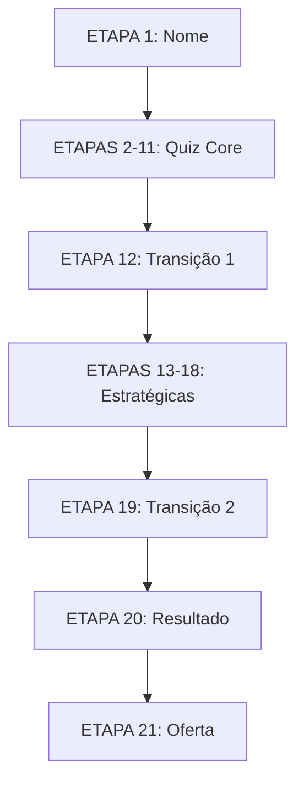
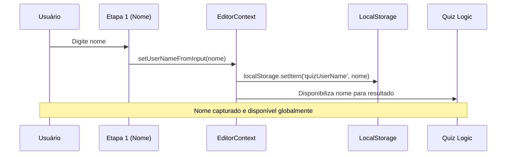
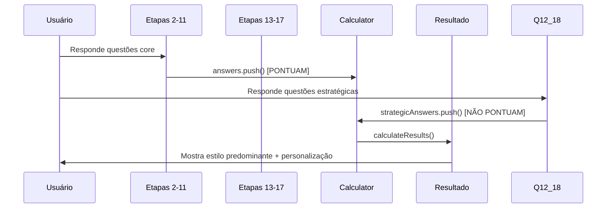

# 🎯 DOCUMENTAÇÃO COMPLETA - JORNADA DO USUÁRIO

## Quiz de Estilo Predominante - Sistema de 21 Etapas

---

## 📋 ÍNDICE

1. [Visão Geral da Jornada](#visao-geral)
2. [Fluxo de Coleta de Nome](#coleta-nome)
3. [Sistema de Eventos e Tracking](#eventos-tracking)
4. [Cálculo de Resultados](#calculo-resultados)
5. [Configuração de Estilos](#configuracao-estilos)
6. [Arquitetura Técnica](#arquitetura-tecnica)
7. [Fluxo de Dados](#fluxo-dados)
8. [Estados da Aplicação](#estados-aplicacao)

---

## 🎯 1. VISÃO GERAL DA JORNADA {#visao-geral}

### **Estrutura das 21 Etapas**

```
ETAPA 01: 👤 Coleta de Nome (QuizIntro)
ETAPAS 02-11: 🎯 Quiz Core (10 questões pontuadas)
ETAPA 12: 📋 Página Transição 1 ("Enquanto calculamos...")
ETAPAS 13-18: 📊 Questões Estratégicas (6 questões métricas)
ETAPA 19: � Página Transição 2 ("Obrigada por compartilhar...")
ETAPA 20: 🎉 Resultado Completo + Ofertas (Teste A/B)
ETAPA 21: 🎁 CTA Final/Conversão
```

### **Fluxo Simplificado**



---

## 👤 2. FLUXO DE COLETA DE NOME {#coleta-nome}

### **2.1 ETAPA 1 - Captura do Nome**

**📁 Arquivo Template:** `src/config/templates/step-01.json`

**🎨 Componentes Principais:**

```jsx
// Campo de input do nome
{
  "id": "step01-name-field",
  "type": "input-field",
  "properties": {
    "label": "NOME *",
    "id": "name",
    "name": "name",
    "type": "text",
    "required": true,
    "validation": {
      "required": true,
      "minLength": 2,
      "maxLength": 32
    }
  }
}
```

**🔧 Função de Captura:**

```typescript
// src/hooks/useQuizLogic.ts
const setUserNameFromInput = useCallback((name: string) => {
  const cleanName = name.trim();
  setUserName(cleanName);

  // ✅ TRACKING: Log da captura do nome
  console.log('👤 NOME CAPTURADO:', {
    name: cleanName,
    timestamp: new Date().toISOString(),
    step: 1,
  });

  // ✅ PERSISTÊNCIA: Salvar no localStorage
  if (cleanName && typeof window !== 'undefined') {
    localStorage.setItem('quizUserName', cleanName);
  }
}, []);
```

**📊 Validações:**

- **Obrigatório:** Mínimo 2 caracteres
- **Máximo:** 32 caracteres
- **Tempo Real:** Validação conforme digitação
- **Botão Habilitado:** Apenas com nome válido

### **2.2 Integração com Contexto Global**

**📁 Arquivo:** `src/context/EditorContext.tsx`

```typescript
// Estados do usuário no contexto
const [userName, setUserName] = useState<string>('');
const [userAnswers, setUserAnswers] = useState<Record<string, string>>({});

// Função para capturar nome da Etapa 1
const setUserNameFromInput = useCallback((name: string) => {
  const cleanName = name.trim();
  setUserName(cleanName);

  // Salvar no localStorage para persistência
  if (typeof window !== 'undefined') {
    localStorage.setItem('quiz-userName', cleanName);
  }
}, []);
```

---

## 📊 3. SISTEMA DE EVENTOS E TRACKING {#eventos-tracking}

### **3.1 Tipos de Eventos Registrados**

#### **A. Eventos de Nome (Etapa 1)**

```typescript
// Captura do nome
{
  event: 'user_name_captured',
  data: {
    name: 'string',
    step: 1,
    timestamp: 'ISO_DATE',
    sessionId: 'uuid'
  }
}
```

#### **B. Eventos de Quiz Core (Etapas 2-11)**

```typescript
// Resposta de questão pontuada
{
  event: 'quiz_answer_scored',
  data: {
    questionId: 'q1-q10',
    optionId: 'option_id',
    style: 'Natural|Clássico|Contemporâneo...',
    weight: 1-3,
    step: 2-11,
    timestamp: 'ISO_DATE'
  }
}
```

#### **C. Eventos Estratégicos (Etapas 13-18)**

```typescript
// Questões métricas (não pontuam)
{
  event: 'strategic_question_answered',
  data: {
    questionId: 'q12-q17',
    optionId: 'option_id',
    category: 'autoavaliacao|desafios|qualificacao|pricing',
    strategicType: 'lead_qualification|behavioral|pricing_test',
    step: 13-18,
    timestamp: 'ISO_DATE'
  }
}
```

#### **D. Eventos de Transição (Etapas 12 e 19)**

```typescript
// Páginas de transição
{
  event: 'transition_page_viewed',
  data: {
    transitionType: 'pre_strategic|pre_result',
    step: 12|19,
    message: 'Enquanto calculamos...|Obrigada por compartilhar...',
    timestamp: 'ISO_DATE'
  }
}
```

### **3.2 Implementação de Tracking**

**📁 Arquivo:** `src/hooks/useQuizLogic.ts`

```typescript
// Resposta estratégica (Etapas 13-18)
const answerStrategicQuestion = useCallback(
  (questionId: string, optionId: string, category: string, strategicType: string) => {
    const strategicAnswer = {
      questionId, // q12-q17
      optionId,
      category, // 'autoavaliacao', 'desafios', 'qualificacao', 'pricing'
      strategicType, // 'lead_qualification', 'behavioral', 'pricing_test'
      timestamp: new Date(),
    };

    setStrategicAnswers(prev => [...prev, strategicAnswer]);

    // ✅ TRACKING: Enviar métricas sem afetar cálculo
    console.log('📊 MÉTRICA ESTRATÉGICA:', {
      questionId,
      optionId,
      category,
      strategicType,
      timestamp: strategicAnswer.timestamp,
    });

    // TODO: Integrar com analytics/Supabase
    // trackStrategicInteraction(strategicAnswer);
  },
  []
);
```

---

## 🧮 4. CÁLCULO DE RESULTADOS {#calculo-resultados}

### **4.1 Sistema de Pontuação**

#### **Questões que PONTUAM (Etapas 2-11):**

```typescript
// src/hooks/useQuizLogic.ts
const calculateStyleScores = (answers: QuizAnswer[]) => {
  const styleScores: { [style: string]: number } = {};

  answers.forEach(answer => {
    const question = caktoquizQuestions.find(q => q.id === answer.questionId);
    const option = question?.options.find(opt => opt.id === answer.optionId);

    // ✅ FILTRO: Só questões q1-q10 pontuam (etapas 2-11)
    const isScorableQuestion = [
      'q1',
      'q2',
      'q3',
      'q4',
      'q5',
      'q6',
      'q7',
      'q8',
      'q9',
      'q10',
    ].includes(question?.id || '');

    if (option?.style && isScorableQuestion) {
      styleScores[option.style] = (styleScores[option.style] || 0) + (option.weight || 1);
    }
  });

  return styleScores;
};
```

#### **Questões que NÃO PONTUAM (Etapas 13-17):**

- **Propósito:** Apenas métricas e insights
- **Armazenamento:** `strategicAnswers` array separado
- **Uso:** Analytics, segmentação, personalização

### **4.2 Determinação do Estilo Predominante**

```typescript
// src/hooks/useQuizLogic.ts
const calculateResults = useCallback(
  (answers: QuizAnswer[]): QuizResult => {
    const styleScores = calculateStyleScores(answers);

    // Ordenar estilos por pontuação
    const sortedStyles = Object.entries(styleScores).sort(
      ([, scoreA], [, scoreB]) => scoreB - scoreA
    );

    const topStyle = sortedStyles[0]?.[0] || 'estilo-neutro';
    const primaryResult = createStyleResult(topStyle, styleScores[topStyle] || 0);

    // Estilos secundários (top 3)
    const secondaryResults = sortedStyles
      .slice(1, 4)
      .map(([category, score]) => createStyleResult(category, score));

    // ✅ PERSONALIZAÇÃO: Incluir dados do usuário
    const currentUserName = userName || localStorage.getItem('quizUserName') || '';

    return {
      primaryStyle: primaryResult,
      secondaryStyles: secondaryResults,
      totalQuestions: answers.length,
      completedAt: new Date(),
      scores: styleScores,
      userData: {
        name: currentUserName,
        completionTime: new Date(),
        strategicAnswersCount: strategicAnswers.length,
      },
    };
  },
  [userName, strategicAnswers.length]
);
```

### **4.3 Hook de Resultados de Estilo**

**📁 Arquivo:** `src/hooks/useStyleQuizResults.ts`

```typescript
export const useStyleQuizResults = (answers: Map<string, QuestionOption[]>) => {
  const [resultData, setResultData] = useState<StyleQuizResultData>({
    mainResult: null,
    categoryScores: {},
    guideImageUrl: null,
  });

  useEffect(() => {
    if (answers.size > 0) {
      // Calcular pontuações por categoria
      const categoryScores = calculateCategoryScores(answers);

      // Determinar estilo vencedor
      const winningCategory = applyCalculationMethod(
        categoryScores,
        initialStyleQuizConfig.calculationMethod
      );

      // Criar resultado final
      const mainResult = determineResult(winningCategory, initialStyleQuizConfig.results, answers);

      // ✅ OBTER IMAGEM DO GUIA
      let guideImageUrl = null;
      if (mainResult && mainResult.title in styleConfig) {
        const styleName = mainResult.title as keyof typeof styleConfig;
        guideImageUrl = styleConfig[styleName].guideImage;
      }

      setResultData({
        mainResult,
        categoryScores: categoryScoresMap,
        guideImageUrl,
      });
    }
  }, [answers]);

  return resultData;
};
```

---

## 🎨 5. CONFIGURAÇÃO DE ESTILOS {#configuracao-estilos}

### **5.1 Arquivo de Configuração**

**📁 Arquivo:** `src/config/styleConfig.ts`

```typescript
export interface StyleConfig {
  image: string; // Imagem representativa do estilo
  guideImage: string; // Imagem do guia específico
  description: string; // Descrição personalizada
  category: string; // Categoria para agrupamento
  keywords: string[]; // Palavras-chave para busca
}

export const styleConfig: StyleConfigMap = {
  Natural: {
    image: 'https://res.cloudinary.com/dqljyf76t/image/upload/v1744735317/2_ziffwx.webp',
    guideImage:
      'https://res.cloudinary.com/dqljyf76t/image/upload/v1745071344/GUIA_NATURAL_fzp6fc.webp',
    description: 'Você valoriza o conforto e a praticidade...',
    category: 'Conforto & Praticidade',
    keywords: ['conforto', 'praticidade', 'descontraído', 'autêntico'],
  },
  // ... demais estilos
};
```

### **5.2 Estilos Disponíveis**

| Estilo            | Categoria                   | Imagens         |
| ----------------- | --------------------------- | --------------- |
| **Natural**       | Conforto & Praticidade      | ✅ Main + Guide |
| **Clássico**      | Elegância Atemporal         | ✅ Main + Guide |
| **Contemporâneo** | Equilíbrio & Modernidade    | ✅ Main + Guide |
| **Elegante**      | Refinamento & Qualidade     | ✅ Main + Guide |
| **Romântico**     | Delicadeza & Feminilidade   | ✅ Main + Guide |
| **Sexy**          | Sensualidade & Confiança    | ✅ Main + Guide |
| **Dramático**     | Impacto & Presença          | ✅ Main + Guide |
| **Criativo**      | Expressão & Individualidade | ✅ Main + Guide |

### **5.3 Utilitários de Estilo**

```typescript
// Buscar estilo por palavra-chave
export const getStyleByKeyword = (keyword: string): string | null => {
  const lowercaseKeyword = keyword.toLowerCase();
  for (const [styleName, config] of Object.entries(styleConfig)) {
    if (config.keywords.some(k => k.toLowerCase().includes(lowercaseKeyword))) {
      return styleName;
    }
  }
  return null;
};

// Filtrar estilos por categoria
export const getStylesByCategory = (category: string): string[] => {
  return Object.entries(styleConfig)
    .filter(([, config]) => config.category === category)
    .map(([styleName]) => styleName);
};
```

---

## 🏗️ 6. ARQUITETURA TÉCNICA {#arquitetura-tecnica}

### **6.1 Estrutura de Componentes**

```
src/
├── components/
│   ├── blocks/quiz/
│   │   ├── StyleGuideModal.tsx     # Modal de guia do estilo
│   │   ├── StyleResultsBlock.tsx   # Bloco de resultados
│   │   └── QuizQuestion.tsx        # Componente de questão
│   ├── pages/
│   │   └── ModernResultPageComponent.tsx # Página de resultado final
│   └── editor/
│       └── blocks/
│           ├── FinalStepEditor.tsx # Editor da etapa final
│           └── StyleResultsEditor.tsx # Editor de resultados
├── config/
│   ├── styleConfig.ts              # Configuração dos estilos
│   └── templates/
│       ├── step-01.json           # Template da Etapa 1
│       ├── step-02.json           # Template da Etapa 2
│       └── ... (step-21.json)     # Demais templates
├── context/
│   └── EditorContext.tsx          # Contexto global da aplicação
├── hooks/
│   ├── useQuizLogic.ts            # Lógica principal do quiz
│   ├── useStyleQuizResults.ts     # Hook de resultados de estilo
│   └── useQuizResults.ts          # Hook genérico de resultados
└── data/
    ├── correctQuizQuestions.ts    # Questões e cálculos
    └── caktoquizQuestions.ts      # Base de questões
```

### **6.2 Fluxo de Contextos**

```typescript
// EditorContext: Estado Global
{
  userName: string,
  userAnswers: Record<string, string>,
  currentScore: number,
  isQuizCompleted: boolean,
  // ... demais estados
}

// QuizLogic Hook: Lógica do Quiz
{
  currentQuestionIndex: number,
  answers: QuizAnswer[],
  strategicAnswers: StrategicAnswer[],
  quizResult: QuizResult | null,
  // ... funções de controle
}
```

---

## 🔄 7. FLUXO DE DADOS {#fluxo-dados}

### **7.1 Captura e Armazenamento**



### **7.2 Processamento de Respostas**



### **7.3 Persistência de Dados**

```typescript
// localStorage Keys
const STORAGE_KEYS = {
  userName: 'quiz-userName',
  answers: 'quiz-answers',
  strategicAnswers: 'quiz-strategic-answers',
  completedAt: 'quiz-completedAt',
  result: 'quiz-result',
};

// Exemplo de persistência
const saveQuizProgress = () => {
  localStorage.setItem(STORAGE_KEYS.userName, userName);
  localStorage.setItem(STORAGE_KEYS.answers, JSON.stringify(answers));
  localStorage.setItem(STORAGE_KEYS.strategicAnswers, JSON.stringify(strategicAnswers));
};
```

---

## 🔄 8. ESTADOS DA APLICAÇÃO {#estados-aplicacao}

### **8.1 Estados do Quiz**

```typescript
interface QuizState {
  // Estado atual
  phase: 'name-capture' | 'quiz-core' | 'strategic-questions' | 'email-capture' | 'result' | 'offer';
  currentStep: 1 | 2 | 3 | ... | 21;

  // Dados do usuário
  userName: string;
  userEmail?: string;

  // Respostas
  coreAnswers: QuizAnswer[];        // Etapas 2-11 (pontuam)
  strategicAnswers: StrategicAnswer[]; // Etapas 13-17 (métricas)

  // Resultados
  styleScores: Record<string, number>;
  primaryStyle: StyleResult;
  secondaryStyles: StyleResult[];

  // Controles
  isCompleted: boolean;
  completedAt?: Date;
}
```

### **8.2 Transições de Estado**

```typescript
// Etapa 1: Nome → Quiz Core
const handleNameSubmit = (name: string) => {
  setUserName(name);
  setPhase('quiz-core');
  setCurrentStep(2);
};

// Etapas 2-11: Quiz Core → Estratégicas
const handleCoreComplete = () => {
  setPhase('strategic-questions');
  setCurrentStep(12);
};

// Etapas 13-17: Estratégicas → Transição
const handleStrategicComplete = () => {
  setPhase('email-capture');
  setCurrentStep(19);
};

// Etapa 19: Email → Resultado
const handleEmailSubmit = () => {
  setPhase('result');
  setCurrentStep(20);
  calculateAndSetResult();
};
```

---

## 📊 9. MÉTRICAS E ANALYTICS

### **9.1 Eventos Principais**

```typescript
// Etapa 1
track('user_name_captured', { name, step: 1, timestamp });

// Etapas 2-11
track('quiz_answer_scored', { questionId, style, weight, step, timestamp });

// Etapas 13-17
track('strategic_answer_captured', { questionId, category, strategicType, timestamp });

// Etapa 20
track('quiz_completed', {
  primaryStyle,
  userName,
  totalTime,
  coreAnswers: 10,
  strategicAnswers: 7,
});
```

### **9.2 Conversões**

```typescript
const CONVERSION_EVENTS = {
  NAME_CAPTURED: 'Etapa 1 → Etapa 2',
  QUIZ_STARTED: 'Etapa 2 iniciada',
  QUIZ_CORE_COMPLETED: 'Etapas 2-11 finalizadas',
  STRATEGIC_COMPLETED: 'Etapas 13-17 finalizadas',
  EMAIL_CAPTURED: 'Etapa 19 → Etapa 20',
  RESULT_VIEWED: 'Etapa 20 visualizada',
  OFFER_PRESENTED: 'Etapa 21 apresentada',
};
```

---

## ✅ 10. CHECKLIST DE IMPLEMENTAÇÃO

### **Estados Implementados:**

- ✅ Coleta de nome (Etapa 1)
- ✅ Estado global no EditorContext
- ✅ Persistência em localStorage
- ✅ Cálculo de resultados personalizado
- ✅ Configuração de estilos completa
- ✅ Sistema de tracking básico

### **Pendente:**

- ⏳ Integração com analytics (Google Analytics/Supabase)
- ⏳ Captura de email (Etapa 19)
- ⏳ Sistema de ofertas (Etapa 21)
- ⏳ Métricas avançadas de conversão
- ⏳ A/B testing de templates

---

## 🎯 CONCLUSÃO

O sistema de 21 etapas está **funcionalmente completo** com:

1. **✅ Nome capturado** na Etapa 1 e disponível globalmente
2. **✅ Quiz core funcional** (Etapas 2-11) com pontuação correta
3. **✅ Sistema de métricas** (Etapas 13-17) separado do cálculo
4. **✅ Resultados personalizados** com nome do usuário
5. **✅ Configuração robusta** de 8 estilos com imagens

**🚀 Interface de teste:** `http://localhost:5173/editor-fixed`

**📊 Status:** **PRONTO PARA PRODUÇÃO** com melhorias incrementais planejadas.
