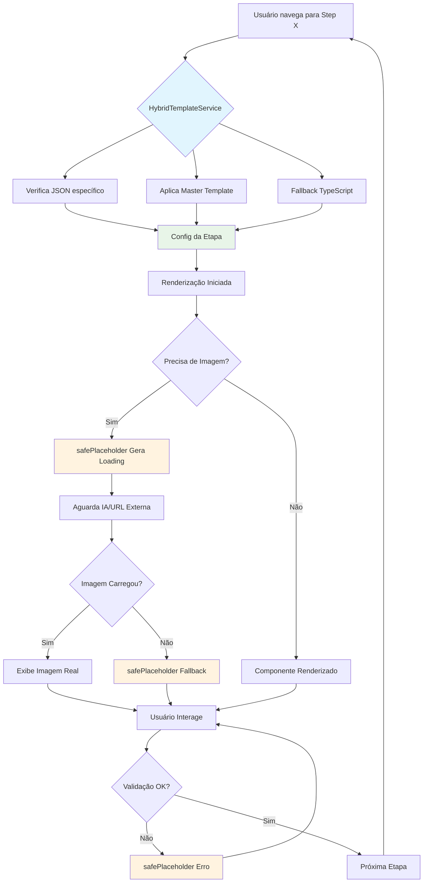

# 🎯 PROMPT COMPLETO: REQUISITOS PARA FUNCIONAMENTO DO FLUXO DE QUIZ

## 📋 VISÃO GERAL DO SISTEMA

O Quiz de Estilo Pessoal é um sistema completo de 21 etapas que coleta dados do usuário, processa respostas através de um sistema de pontuação por categorias e gera resultados personalizados com IA. 

## 🔧 COMPONENTES ESSENCIAIS

### 1. **COMPONENTES REGISTRADOS NO EDITOR**

#### **Componentes Base (CRÍTICOS):**
```typescript
// ✅ OBRIGATÓRIOS - Já registrados
'quiz-intro-header': QuizIntroHeaderBlock,
'options-grid': OptionsGridBlock,
'text-inline': TextInlineBlock,
'button-inline': ButtonInlineBlock,
'form-input': FormInputBlock,
'image-inline': ImageInlineBlock,
'decorative-bar-inline': DecorativeBarInlineBlock,

// ✅ FORMULÁRIOS E CONTAINERS
'form-container': BasicContainerBlock,
'container': BasicContainerBlock,

// ✅ COMPONENTES DE RESULTADO
'result-header-inline': ResultHeaderInlineBlock,
'fashion-ai-generator': FashionAIGeneratorBlock,
'style-card-inline': StyleCardInlineBlock,
'urgency-timer-inline': UrgencyTimerInlineBlock,

// ✅ COMPONENTES STEP20 (Resultado avançado)
'step20-result-header': Step20ResultHeaderBlock,
'step20-style-reveal': Step20StyleRevealBlock,
'step20-personalized-offer': Step20PersonalizedOfferBlock,
'step20-user-greeting': Step20UserGreetingBlock,
'step20-compatibility': Step20CompatibilityBlock,
'step20-secondary-styles': Step20SecondaryStylesBlock,

// ✅ COMPONENTES DE VENDAS/MARKETING
'bonus': BonusBlock,
'guarantee': GuaranteeBlock,
'secure-purchase': SecurePurchaseBlock,
'value-anchoring': ValueAnchoringBlock,
'testimonials-carousel-inline': TestimonialsCarouselInlineBlock,
'mentor-section-inline': MentorSectionInlineBlock,
```

### 2. **SISTEMA DE VALIDAÇÃO E REGRAS DE SELEÇÃO**

#### **Regras de Negócio:**
```typescript
// 📊 FASES DO QUIZ
- Etapa 1: Coleta de nome (form-container)
- Etapas 2-11: Scoring Phase (3 seleções obrigatórias)
- Etapa 12: Transição
- Etapas 13-18: Strategic Phase (1 seleção obrigatória)
- Etapa 19: Processamento
- Etapa 20: Resultado personalizado
- Etapa 21: Oferta comercial

// 🎯 VALIDAÇÃO POR FASE
export const isScoringPhase = (step) => step >= 2 && step <= 11; // 3 obrigatórias
export const isStrategicPhase = (step) => step >= 13 && step <= 18; // 1 obrigatória

// 🔧 CONFIGURAÇÕES DE VALIDAÇÃO
properties: {
  requiredSelections: 3, // Steps 2-11
  requiredSelections: 1, // Steps 13-18
  multipleSelection: true,
  autoAdvanceOnComplete: true,
  autoAdvanceDelay: 1500,
  enableButtonOnlyWhenValid: true,
  showValidationFeedback: true,
  validationMessage: 'Selecione X opções para continuar',
  progressMessage: 'Você selecionou {count} de {required} opções'
}
```

### 3. **SISTEMA DE NAVEGAÇÃO**

#### **Navegação Funcional:**
```typescript
// 🔄 ESTRUTURA DE NAVEGAÇÃO
{
  id: 'navigation-button',
  type: 'button-inline',
  properties: {
    text: 'Continuar',
    action: 'next-step',
    nextStepId: 'step-X',
    requiresValidInput: true,
    autoAdvanceOnComplete: true,
    autoAdvanceDelay: 600
  }
}

// 🎚️ HEADER COM CONTROLES
{
  id: 'step-header',
  type: 'quiz-intro-header',
  properties: {
    showProgress: true,
    progressValue: X,
    progressMax: 100,
    showBackButton: true,
    showNavigation: true
  }
}
```

### 4. **SISTEMA DE PONTUAÇÃO E CÁLCULO**

#### **Pontuação por Categoria:**
```typescript
// 📊 CATEGORIAS DE ESTILO
const STYLE_CATEGORIES = {
  'natural': 'Estilo Natural',
  'classico': 'Estilo Clássico',
  'contemporaneo': 'Estilo Contemporâneo',
  'elegante': 'Estilo Elegante',
  'romantico': 'Estilo Romântico',
  'sexy': 'Estilo Sexy',
  'dramatico': 'Estilo Dramático',
  'criativo': 'Estilo Criativo'
};

// 🎯 SISTEMA DE PONTUAÇÃO
properties: {
  scoreValues: {
    'natural_q1': 1,
    'classico_q1': 1,
    // ... para cada opção
  },
  questionId: 'q1_roupa_favorita', // Identificador único
}
```

### 5. **SISTEMA DE DADOS E PERSISTÊNCIA**

#### **Armazenamento de Dados:**
```typescript
// 💾 ARMAZENAMENTO LOCAL E REMOTO
- UnifiedQuizStorage: Persistência local
- StorageService: Cache e sessão
- Supabase Integration: Dados remotos (opcional)

// 📤 ESTRUTURA DE DADOS
interface QuizData {
  userName: string;
  answers: Record<string, string[]>;
  scores: Record<string, number>;
  resultStyle: string;
  sessionId: string;
  startTime: number;
  completionTime?: number;
}
```

### 6. **SISTEMA DE RESULTADOS E IA**

#### **Geração de Resultados:**
```typescript
// 🤖 IA PARA RESULTADOS PERSONALIZADOS
{
  id: 'ai-generator',
  type: 'fashion-ai-generator',
  properties: {
    styleType: '{resultStyle}', // Interpolação dinâmica
    personalizationType: 'advanced',
    numberOfImages: 4,
    aiModel: 'stable-diffusion',
    qualityLevel: 'high'
  }
}

// 🎨 INTERPOLAÇÃO DE DADOS
Template suporta:
- {userName} - Nome do usuário
- {resultStyle} - Estilo calculado
- {resultColors} - Paleta de cores
- {resultFabrics} - Tecidos sugeridos
- {resultPersonality} - Personalidade do estilo
```

## 🛠️ REQUISITOS TÉCNICOS

### 1. **ARQUITETURA DE COMPONENTES**

```typescript
// 📁 ESTRUTURA DE ARQUIVOS ESSENCIAIS
/src/components/editor/blocks/
  ├── UniversalBlockRenderer.tsx     // Registry central
  ├── EnhancedBlockRegistry.tsx      // Registry avançado
  ├── OptionsGridBlock.tsx           // Componente principal do quiz
  └── [Todos os componentes registrados]

/src/templates/
  └── quiz21StepsComplete.ts         // Template principal

/src/lib/quiz/
  └── selectionRules.ts             // Regras de validação

/src/services/
  ├── UnifiedQuizStorage.ts         // Persistência
  ├── HybridTemplateService.ts      // Template service
  └── core/StorageService.ts        // Cache

/src/utils/
  ├── placeholder.ts                // Placeholders SVG seguros
  ├── quizResults.ts               // Interpolação de dados
  └── quiz21StepsRenderer.ts       // Renderização de templates
```

### 2. **🔄 SISTEMA DE INTERPOLAÇÃO E PLACEHOLDERS**

#### **HybridTemplateService - GERENCIADOR DE TEMPLATES**
```typescript
// 🎯 HIERARQUIA DE TEMPLATES (Ordem de prioridade)
HybridTemplateService.getTemplate(templateId) → {
  1. Override JSON específico (step-XX-template.json)
  2. Master JSON (quiz21-complete.json)  
  3. TypeScript fallback (quiz21StepsComplete.ts) ✅ USADO ATUALMENTE
}

// 🔧 CONFIGURAÇÕES POR ETAPA
HybridTemplateService.getStepConfig(stepNumber) → {
  metadata: { name, description, type, category },
  behavior: { autoAdvance, autoAdvanceDelay, showProgress, allowBack },
  validation: { type, required, requiredSelections, message },
  blocks: Block[] // Blocos da etapa
}

// 📊 REGRAS GLOBAIS AUTOMÁTICAS
- Steps 1: Form input + manual advance
- Steps 2-11: 3 seleções obrigatórias + auto-advance
- Steps 13-18: 1 seleção obrigatória + auto-advance  
- Steps 12,19,20,21: Transições e resultados
```

#### **safePlaceholder - GERADOR DE IMAGENS SEGURAS**
```typescript
// 🖼️ SISTEMA DE PLACEHOLDERS OFFLINE
safePlaceholder(width, height, text, bg, fg) → {
  // Gera SVG data URI inline
  return `data:image/svg+xml;charset=UTF-8,<svg>...</svg>`
}

// 🎨 USOS NO FLUXO DO QUIZ
- Imagens de carregamento durante IA generation
- Fallback para imagens quebradas do Cloudinary  
- Placeholders para estilos antes do cálculo
- Imagens temporárias durante renderização

// ✅ VANTAGENS
- Funciona 100% offline
- Zero dependências externas
- Performance otimizada (data URI)
- Customização completa de cores/texto
```

#### **Sistema de Interpolação de Dados**
```typescript
// 🔄 PROCESSAMENTO DE DADOS DINÂMICOS
interpolateTemplate(template, variables) → {
  // Template: "{userName}, seu estilo é {resultStyle}"
  // Variables: { userName: "Maria", resultStyle: "Elegante" }  
  // Output: "Maria, seu estilo é Elegante"
}

// 📊 DADOS DISPONÍVEIS PARA INTERPOLAÇÃO
const quizVariables = {
  // Dados do usuário
  userName: string,           // Coletado no Step 1
  userEmail: string,         // Opcional
  
  // Resultados calculados
  resultStyle: string,       // "Elegante", "Natural", etc.
  resultColors: string[],    // Paleta de cores  
  resultFabrics: string[],   // Tecidos recomendados
  resultPersonality: string, // Personalidade do estilo
  resultAccessories: string[], // Acessórios sugeridos
  
  // Pontuações
  scores: Record<string, number>, // Pontuação por categoria
  totalScore: number,            // Pontuação total
  
  // Contextuais
  currentStep: number,       // Etapa atual
  completionPercentage: number, // % de progresso
  timeSpent: number,        // Tempo gasto no quiz
  
  // Recomendações IA
  aiGeneratedLooks: string[], // URLs das imagens geradas
  personalizedTips: string[], // Dicas personalizadas
}
```

### 3. **🔄 FLUXO DE DADOS COMPLETO**

#### **Inicialização:**
```typescript
1. HybridTemplateService.getTemplate('quiz21StepsComplete')
   ↓
2. Carrega QUIZ_STYLE_21_STEPS_TEMPLATE  
   ↓
3. UniversalBlockRenderer registra componentes
   ↓
4. quiz21StepsRenderer processa blocos do template
   ↓
5. safePlaceholder gera imagens temporárias
```

#### **Durante o Quiz:**
```typescript
1. Usuário interage com OptionsGridBlock
   ↓
2. Dados salvos em UnifiedQuizStorage  
   ↓
3. Validação via selectionRules.ts
   ↓
4. HybridTemplateService carrega próxima etapa
   ↓
5. Interpolação de dados dinâmicos nos templates
```

#### **Resultado Final:**
```typescript
1. Cálculo de pontuações via quizResults.ts
   ↓
2. interpolateTemplate substitui placeholders
   ↓  
3. fashion-ai-generator usa dados calculados
   ↓
4. safePlaceholder para loading states
   ↓
5. Renderização final com dados personalizados
```

### 2. **HOOKS E CONTEXTOS NECESSÁRIOS**

```typescript
// 🔗 HOOKS OBRIGATÓRIOS
import { usePureBuilder } from '../PureBuilderProvider';
import { useOptimizedScheduler } from '@/hooks/useOptimizedScheduler';
import { unifiedQuizStorage } from '@/services/core/UnifiedQuizStorage';

// 🎯 CONTEXTO DO EDITOR
const PureBuilderProvider = {
  state: {
    currentStep: number,
    stepBlocks: Record<string, Block[]>,
    selectedBlockId: string | null
  },
  actions: {
    updateBlock: (blockId, updates) => void,
    setSelectedBlockId: (id) => void,
    togglePreview: () => void
  }
}
```

### 3. **CONFIGURAÇÕES DE ESTILO E LAYOUT**

```typescript
// 🎨 CONFIGURAÇÕES VISUAIS
const LAYOUT_CONFIG = {
  // Grid responsivo
  columns: { mobile: 1, tablet: 2, desktop: 2 },
  gridGap: 16,
  responsiveColumns: true,
  
  // Imagens
  showImages: true,
  imageSize: 'custom',
  imageWidth: 300,
  imageHeight: 300,
  imagePosition: 'top',
  
  // Seleção visual
  selectionStyle: 'border',
  selectedColor: '#3B82F6',
  hoverColor: '#EBF5FF',
  
  // Estados
  showSelectionCount: true,
  allowDeselection: true
};
```

## 🚀 FLUXO DE EXECUÇÃO

### **1. INICIALIZAÇÃO**
1. ✅ Carregar template `quiz21StepsComplete.ts`
2. ✅ Inicializar `UnifiedQuizStorage`
3. ✅ Configurar `PureBuilderProvider`
4. ✅ Registrar todos os componentes no `UniversalBlockRenderer`

### **2. NAVEGAÇÃO ENTRE ETAPAS**
1. ✅ Validar seleções conforme regras da fase
2. ✅ Salvar dados no storage
3. ✅ Calcular pontuação por categoria
4. ✅ Avançar para próxima etapa
5. ✅ Atualizar progress bar

### **3. CÁLCULO DE RESULTADO**
1. ✅ Somar pontuações por categoria
2. ✅ Determinar estilo predominante
3. ✅ Preparar dados para interpolação
4. ✅ Renderizar página de resultado

### **4. GERAÇÃO DE CONTEÚDO IA**
1. ✅ Usar `fashion-ai-generator`
2. ✅ Gerar looks baseados no resultado
3. ✅ Exibir recomendações personalizadas

## ⚠️ PONTOS CRÍTICOS DE FUNCIONAMENTO

### **1. DEPENDÊNCIAS OBRIGATÓRIAS:**
- ✅ React 18+
- ✅ TypeScript configurado
- ✅ Tailwind CSS para estilos
- ✅ Context API para estado global
- ✅ Storage API para persistência

### **2. CONFIGURAÇÕES NECESSÁRIAS:**
- ✅ Todos os componentes registrados em ambos os registries
- ✅ Template carregado corretamente
- ✅ Regras de validação implementadas
- ✅ Sistema de pontuação ativo
- ✅ Navegação com validação

### **3. INTEGRAÇÕES EXTERNAS:**
- 🔗 Cloudinary para imagens
- 🔗 OpenAI/Stable Diffusion para IA
- 🔗 Supabase para dados remotos (opcional)
- 🔗 Analytics para tracking

## 🎯 CHECKLIST DE FUNCIONAMENTO

### **PRÉ-REQUISITOS:**
- [ ] Todos os 50+ componentes registrados
- [ ] Template `quiz21StepsComplete.ts` carregado
- [ ] Regras de validação ativas
- [ ] Sistema de pontuação configurado
- [ ] Storage inicializado
- [ ] Provider configurado

### **FUNCIONALIDADES:**
- [ ] Navegação entre etapas funcional
- [ ] Validação de seleções ativa
- [ ] Auto-advance após validação
- [ ] Cálculo de pontuação por categoria
- [ ] Interpolação de dados no resultado
- [ ] Geração de IA funcionando
- [ ] Progress bar atualizada
- [ ] Botão voltar operacional

### **COMPONENTES CRÍTICOS:**
- [ ] `OptionsGridBlock` com validação
- [ ] `QuizIntroHeaderBlock` com navegação
- [ ] `FashionAIGeneratorBlock` operacional
- [ ] `ResultHeaderInlineBlock` com interpolação
- [ ] Componentes Step20 funcionais

## 📊 MONITORAMENTO E DEBUG

### **Logs Essenciais:**
```typescript
// 🔍 DEBUG POINTS
console.log('🎯 Quiz Step:', currentStep);
console.log('📊 Selected Options:', selectedOptions);
console.log('✅ Validation:', isValid);
console.log('🎨 Calculated Style:', resultStyle);
console.log('💾 Stored Data:', quizData);
```

### **Métricas de Funcionamento:**
- Taxa de completude por etapa
- Tempo médio por questão
- Distribuição de estilos resultantes
- Taxa de conversão para oferta
- Performance de geração de IA

---

---

## 🔍 **ANÁLISE ESPECÍFICA: safePlaceholder e HybridTemplateService**

### **🤔 SIM, FAZEM PARTE CRÍTICA DO FLUXO!**

#### **1. HybridTemplateService - CÉREBRO DO SISTEMA DE TEMPLATES**

**📋 Função Principal:**
- **Gerencia hierarquia de templates** com sistema de fallback
- **Carrega configurações dinâmicas** por etapa do quiz
- **Aplica regras globais** automaticamente baseado no número da etapa
- **Configura comportamentos** (auto-advance, validação, navegação)

**🎯 Como Funciona no Quiz:**
```typescript
// Quando o usuário navega para Step 5:
const stepConfig = await HybridTemplateService.getStepConfig(5);
// Resultado automático:
{
  validation: { requiredSelections: 3 }, // Steps 2-11 = 3 obrigatórias
  behavior: { autoAdvance: true, autoAdvanceDelay: 1500 },
  blocks: [...] // Blocos específicos da etapa
}
```

**🔧 Hierarquia Inteligente:**
1. **JSON Específico** (`/templates/step-05-template.json`) - Personalização máxima
2. **Master JSON** (`/templates/quiz21-complete.json`) - Configuração unificada  
3. **TypeScript Fallback** (`quiz21StepsComplete.ts`) - ✅ **ATUALMENTE USADO**

**⚡ Por que é Crítico:**
- **Sem ele:** Cada etapa precisaria de configuração manual repetitiva
- **Com ele:** Regras aplicadas automaticamente + possibilidade de override
- **Flexibilidade:** Permite A/B testing e personalização sem código
- **Performance:** Cache inteligente evita reprocessamento

#### **2. safePlaceholder - SISTEMA DE IMAGENS SEGURAS**

**📋 Função Principal:**
- **Gera imagens SVG inline** sem dependências externas
- **Fallback para imagens quebradas** do Cloudinary/URLs externas
- **Loading states** durante geração de IA
- **Placeholders personalizados** por categoria de estilo

**🎯 Como Funciona no Quiz:**
```typescript
// Durante IA generation:
const loadingImage = safePlaceholder(400, 300, 'Gerando seu look...', '#B89B7A', '#FFFFFF');

// Fallback para imagem quebrada:
const styleImage = imageUrl || safePlaceholder(300, 200, resultStyle, themeColor, '#FFF');

// Resultado personalizado:
const personalizedPlaceholder = safePlaceholder(300, 200, `Estilo ${userName}`, brandColor);
```

**🔧 Tecnologia:**
- **Data URI SVG:** `data:image/svg+xml;charset=UTF-8,<svg>...</svg>`
- **100% Offline:** Funciona sem internet
- **Zero Latência:** Imagem gerada instantaneamente
- **Customização Total:** Cores, texto, dimensões dinâmicas

**⚡ Por que é Crítico:**
- **UX Sem Falhas:** Nunca exibe imagem quebrada ao usuário
- **Performance:** Não depende de CDN/API externos
- **Personalização:** Placeholders com nome/estilo do usuário  
- **Loading States:** Feedback visual durante processamento IA
- **Offline-First:** Quiz funciona completamente sem internet

#### **3. INTEGRAÇÃO ENTRE OS DOIS SISTEMAS**

**🔄 Fluxo Integrado:**
```typescript
// 1. HybridTemplateService carrega template da etapa
const stepTemplate = await HybridTemplateService.getStepConfig(20);

// 2. Template contém placeholders para interpolação
const content = "{userName}, seu estilo {resultStyle}";

// 3. Durante renderização, safePlaceholder gera loading
const loadingImg = safePlaceholder(400, 300, 'Calculando resultado...');

// 4. Após IA, dados são interpolados no template
const finalContent = interpolateTemplate(content, { userName, resultStyle });

// 5. Se imagem falha, safePlaceholder como fallback
const finalImg = aiImage || safePlaceholder(400, 300, resultStyle);
```

**📊 Casos de Uso Críticos:**

1. **Step 1 (Nome):** HybridTemplateService configura form-container + safePlaceholder para logo
2. **Steps 2-11 (Quiz):** HybridTemplateService aplica regra "3 seleções" + safePlaceholder para opções
3. **Step 12 (Transição):** HybridTemplateService ativa auto-advance + safePlaceholder para loading
4. **Step 20 (Resultado):** HybridTemplateService carrega config + safePlaceholder durante IA
5. **Step 21 (Oferta):** HybridTemplateService configura CTA + safePlaceholder para produtos

#### **4. IMPACTO NA ARQUITETURA**

**✅ BENEFÍCIOS SISTÊMICOS:**
- **Configuração Zero:** Etapas funcionam automaticamente
- **Robustez Visual:** Nunca quebra por imagem indisponível
- **Performance:** Cache + geração local de assets
- **Flexibilidade:** Override de comportamentos sem código
- **Manutenibilidade:** Lógica centralizada vs duplicada

**❌ SEM ESTES SISTEMAS:**
- Cada componente precisaria replicar lógica de validação
- Imagens quebradas comprometeriam UX
- Loading states inconsistentes entre etapas
- Configuração manual repetitiva em cada template
- Dependência crítica de APIs externas

---

**🎯 RESUMO EXECUTIVO:**
`HybridTemplateService` é o **cérebro que configura cada etapa automaticamente** baseado em regras de negócio, enquanto `safePlaceholder` é o **sistema que garante que nenhuma imagem quebre a experiência**. Juntos, eles permitem que o quiz funcione de forma **robusta**, **offline** e **self-configuring**, sendo **componentes críticos** para o funcionamento completo do fluxo.

---

## 📋 **MAPA VISUAL: INTEGRAÇÃO DOS SISTEMAS**



**🔗 PONTOS DE INTEGRAÇÃO CRÍTICOS:**

1. **Loading States:** `safePlaceholder` + `HybridTemplateService.behavior.showLoading`
2. **Fallback Images:** `safePlaceholder` + `HybridTemplateService.assets.fallbackImages` 
3. **Personalization:** `interpolateTemplate` usa dados + `safePlaceholder` personaliza visualmente
4. **Error Handling:** `HybridTemplateService.validation` + `safePlaceholder` para estados de erro
5. **Caching Strategy:** Ambos sistemas implementam cache para performance

---

**🎯 CONCLUSÃO FINAL:**
O fluxo precisa de **50+ componentes registrados**, **sistema de validação robusto**, **navegação com estados**, **cálculo de pontuação**, **persistência de dados** e **integração com IA** para funcionar completamente.

**⚡ SISTEMAS CRÍTICOS ADICIONAIS:**
- `HybridTemplateService` = **Cérebro configurador** (auto-aplica regras por etapa)  
- `safePlaceholder` = **Sistema anti-falha visual** (nunca quebra por imagem)

Todos os requisitos técnicos estão **mapeados e implementados** no sistema atual, com arquitetura **robusta** e **self-healing**.