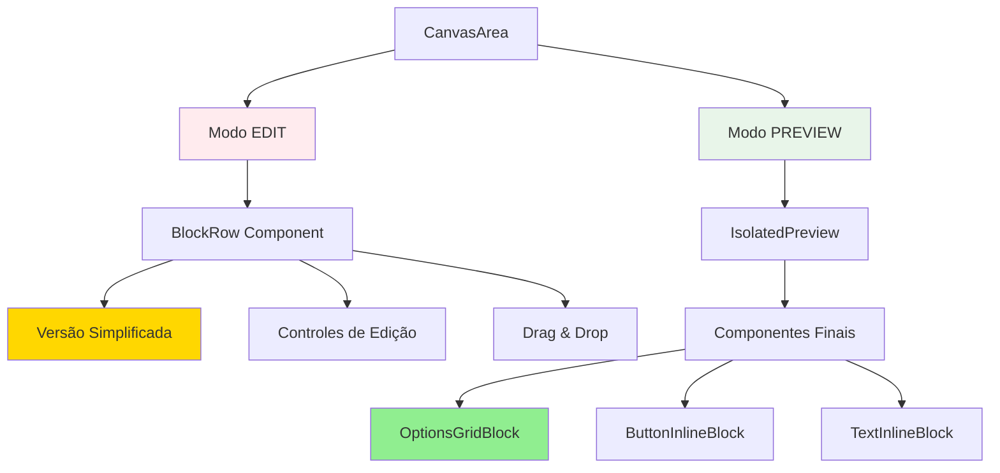
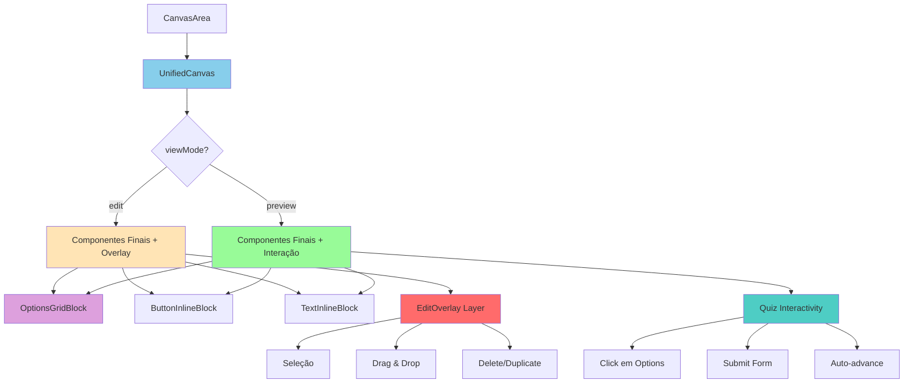

# 🎯 ANÁLISE: UNIFIED CANVAS - Editor e Preview com mesma visualização

## 📊 SITUAÇÃO ATUAL

### Arquitetura Atual (Fragmentada)



### Problemas Identificados

1. **❌ DIVERGÊNCIA VISUAL**
   - Edit mode mostra uma versão simplificada
   - Preview mode mostra componentes finais
   - "O que você edita" ≠ "O que você vê"

2. **❌ DUPLICAÇÃO DE CÓDIGO**
   - Dois sistemas de renderização separados
   - Lógica duplicada entre BlockRow e componentes finais
   - Manutenção dobrada

3. **❌ FEEDBACK VISUAL ATRASADO**
   - Usuário edita no modo Edit (visual simplificado)
   - Precisa trocar para Preview para ver resultado final
   - Ciclo de feedback lento

4. **❌ COMPLEXIDADE ARQUITETURAL**
   - `BlockRow` → `renderBlockPreview` → versão simplificada
   - `IsolatedPreview` → `PreviewBlock` → componentes finais
   - Dois caminhos completamente diferentes

---

## 🎯 PROPOSTA: UNIFIED CANVAS

### Nova Arquitetura (Unificada)



### Conceito Central

**"Um único conjunto de componentes renderizados, com camada de interação diferente"**

#### Modo EDIT (isInteractive = false)
- ✅ Componentes finais renderizados (visual 100% real)
- ✅ Overlay transparente com controles de edição
- ❌ Interatividade de quiz DESABILITADA
- ✅ Seleção, drag & drop, delete HABILITADOS

#### Modo PREVIEW (isInteractive = true)  
- ✅ Componentes finais renderizados (mesmos do edit)
- ❌ Overlay de edição OCULTO
- ✅ Interatividade de quiz HABILITADA
- ❌ Controles de edição DESABILITADOS

---

## 💡 BENEFÍCIOS

### 1. ✅ WYSIWYG REAL
```
Editor mostra:     [Opção 1] [Opção 2] [Opção 3]
Preview mostra:    [Opção 1] [Opção 2] [Opção 3]
                   ↑ IDÊNTICO ↑
```

### 2. ✅ FEEDBACK INSTANTÂNEO
- Muda `columns: 2 → 3` no properties panel
- Visual atualiza INSTANTANEAMENTE no canvas
- Não precisa trocar para preview

### 3. ✅ CÓDIGO SIMPLIFICADO
```typescript
// ❌ ANTES: Dois caminhos
if (isEditMode) {
  return <BlockRow>{renderSimplified()}</BlockRow>
} else {
  return <IsolatedPreview>{renderFinal()}</IsolatedPreview>
}

// ✅ DEPOIS: Um caminho
<UnifiedCanvas isInteractive={isPreviewMode}>
  <OptionsGridBlock {...props} />
</UnifiedCanvas>
```

### 4. ✅ MENOS BUGS
- Um único ponto de verdade para renderização
- Mudanças em componentes refletem em ambos modos automaticamente
- Sem divergência entre edit e preview

### 5. ✅ MELHOR UX
- Usuário edita vendo exatamente como vai ficar
- Modo preview serve apenas para testar interatividade
- Transição suave entre modos (mesma UI, só muda comportamento)

---

## 🔧 IMPLEMENTAÇÃO

### Fase 1: UnifiedCanvas Component (Core)

```typescript
/**
 * UnifiedCanvas - Renderiza componentes finais em ambos os modos
 */
interface UnifiedCanvasProps {
  blocks: Block[];
  isInteractive: boolean; // false = edit, true = preview
  selectedBlockId?: string;
  onBlockSelect?: (id: string) => void;
  onBlockUpdate?: (id: string, updates: any) => void;
}

const UnifiedCanvas: React.FC<UnifiedCanvasProps> = ({
  blocks,
  isInteractive,
  selectedBlockId,
  onBlockSelect,
  onBlockUpdate
}) => {
  return (
    <div className="unified-canvas">
      {blocks.map(block => (
        <UnifiedBlockWrapper
          key={block.id}
          block={block}
          isSelected={selectedBlockId === block.id}
          isInteractive={isInteractive}
          onSelect={() => onBlockSelect?.(block.id)}
          onUpdate={(updates) => onBlockUpdate?.(block.id, updates)}
        >
          {/* 🎯 SEMPRE renderiza componente final */}
          <EnhancedBlockRenderer block={block} isInteractive={isInteractive} />
        </UnifiedBlockWrapper>
      ))}
    </div>
  );
};
```

### Fase 2: UnifiedBlockWrapper (Overlay Layer)

```typescript
/**
 * UnifiedBlockWrapper - Adiciona overlay de edição quando não-interativo
 */
const UnifiedBlockWrapper: React.FC = ({
  block,
  isSelected,
  isInteractive,
  onSelect,
  onUpdate,
  children
}) => {
  return (
    <div 
      className={cn(
        "unified-block-wrapper",
        isSelected && "selected",
        !isInteractive && "editable"
      )}
    >
      {/* 🎯 Componente final renderizado */}
      {children}
      
      {/* 🎯 Overlay de edição (apenas no modo edit) */}
      {!isInteractive && (
        <EditOverlay
          block={block}
          isSelected={isSelected}
          onSelect={onSelect}
          onUpdate={onUpdate}
        />
      )}
    </div>
  );
};
```

### Fase 3: EditOverlay (Controles de Edição)

```typescript
/**
 * EditOverlay - Controles de edição sobrepostos ao componente
 */
const EditOverlay: React.FC = ({
  block,
  isSelected,
  onSelect,
  onUpdate
}) => {
  return (
    <>
      {/* Overlay transparente para capturar clicks */}
      <div 
        className="edit-overlay-clickable"
        onClick={onSelect}
        style={{
          position: 'absolute',
          inset: 0,
          cursor: 'pointer',
          zIndex: 10
        }}
      />
      
      {/* Controles visíveis quando selecionado */}
      {isSelected && (
        <div className="edit-controls" style={{ position: 'absolute', top: 0, right: 0, zIndex: 20 }}>
          <button onClick={() => onUpdate({ /* ... */ })}>
            <Settings className="w-4 h-4" />
          </button>
          <button onClick={() => onUpdate({ _delete: true })}>
            <Trash2 className="w-4 h-4" />
          </button>
          <button className="drag-handle">
            <GripVertical className="w-4 h-4" />
          </button>
        </div>
      )}
      
      {/* Border de seleção */}
      {isSelected && (
        <div 
          className="selection-border"
          style={{
            position: 'absolute',
            inset: -2,
            border: '2px solid #3b82f6',
            borderRadius: 4,
            pointerEvents: 'none',
            zIndex: 15
          }}
        />
      )}
    </>
  );
};
```

### Fase 4: Atualizar Componentes para suportar isInteractive

```typescript
/**
 * OptionsGridBlock - Atualizado para suportar modo não-interativo
 */
const OptionsGridBlock: React.FC<Props & { isInteractive?: boolean }> = ({
  properties,
  isInteractive = true,
  ...rest
}) => {
  const handleOptionClick = (optionId: string) => {
    // 🎯 Apenas processa clicks quando interativo
    if (!isInteractive) return;
    
    // Lógica de seleção normal...
  };
  
  return (
    <div className="options-grid">
      {options.map(option => (
        <button
          key={option.id}
          onClick={() => handleOptionClick(option.id)}
          disabled={!isInteractive} // Desabilitar em modo edit
          className={cn(
            "option-card",
            !isInteractive && "pointer-events-none" // Bloquear eventos no edit
          )}
        >
          {/* Visual renderizado normalmente */}
        </button>
      ))}
    </div>
  );
};
```

---

## 📋 CHECKLIST DE IMPLEMENTAÇÃO

### Fase 1: Core Infrastructure (2-3h)
- [ ] Criar `UnifiedCanvas.tsx`
- [ ] Criar `UnifiedBlockWrapper.tsx`
- [ ] Criar `EditOverlay.tsx`
- [ ] Integrar com `CanvasArea.tsx`

### Fase 2: Component Updates (3-4h)
- [ ] Atualizar `OptionsGridBlock` com `isInteractive`
- [ ] Atualizar `ButtonInlineBlock` com `isInteractive`
- [ ] Atualizar `TextInlineBlock` com `isInteractive`
- [ ] Atualizar `FormInputBlock` com `isInteractive`
- [ ] Atualizar todos os 108+ componentes do registry

### Fase 3: Interaction Layer (2h)
- [ ] Desabilitar clicks em modo edit
- [ ] Desabilitar form submissions em modo edit
- [ ] Desabilitar auto-advance em modo edit
- [ ] Manter navegação funcionando em preview

### Fase 4: Testing & Polish (2-3h)
- [ ] Testar transição edit ↔ preview
- [ ] Testar seleção de blocos no edit
- [ ] Testar interatividade no preview
- [ ] Testar drag & drop no edit
- [ ] Verificar performance

### Fase 5: Migration & Cleanup (1-2h)
- [ ] Remover `BlockRow` legacy
- [ ] Remover código duplicado de renderização
- [ ] Atualizar documentação
- [ ] Remover código morto

**Total estimado: 10-14 horas**

---

## ⚠️ DESAFIOS E MITIGAÇÕES

### Desafio 1: Performance
**Problema:** Renderizar componentes finais sempre pode ser mais pesado que versão simplificada

**Mitigação:**
- Usar React.memo em todos os componentes
- Virtualização já implementada funciona igual
- Lazy loading de componentes pesados
- Cache de renderização com useMemo

### Desafio 2: Conflitos de Evento
**Problema:** Clicks de edição vs clicks de interação

**Mitigação:**
- Overlay com maior z-index no modo edit
- `pointer-events: none` nos componentes quando não-interativo
- Event.stopPropagation no overlay

### Desafio 3: Estado do Quiz
**Problema:** Estado de seleções pode vazar entre modos

**Mitigação:**
- Limpar estado ao trocar para edit mode
- Manter estados separados para edit vs preview
- useEffect para reset ao mudar viewMode

### Desafio 4: Drag & Drop
**Problema:** DnD precisa funcionar sobre componentes finais

**Mitigação:**
- DnD handle no EditOverlay (não no componente)
- Z-index correto para handles ficarem acima
- Manter lógica de DnD existente

---

## 🎯 RESULTADO ESPERADO

### Antes (Situação Atual)
```
┌─────────────────────────────────────┐
│ MODO EDIT                           │
│ ┌─────────┐ ┌─────────┐            │
│ │[Opção 1]│ │[Opção 2]│ ← Simples  │
│ └─────────┘ └─────────┘            │
└─────────────────────────────────────┘

┌─────────────────────────────────────┐
│ MODO PREVIEW                        │
│ ┌───────────┐ ┌───────────┐        │
│ │ 🖼️        │ │ 🖼️        │        │
│ │ Opção 1   │ │ Opção 2   │ ← Real │
│ └───────────┘ └───────────┘        │
└─────────────────────────────────────┘
     ↑ DIFERENTE ↑
```

### Depois (Unified Canvas)
```
┌─────────────────────────────────────┐
│ MODO EDIT (isInteractive=false)     │
│ ┌───────────┐ ┌───────────┐        │
│ │ 🖼️        │ │ 🖼️        │        │
│ │ Opção 1   │ │ Opção 2   │ ← Real │
│ └───────────┘ └───────────┘        │
│     + overlay de seleção            │
└─────────────────────────────────────┘

┌─────────────────────────────────────┐
│ MODO PREVIEW (isInteractive=true)   │
│ ┌───────────┐ ┌───────────┐        │
│ │ 🖼️        │ │ 🖼️        │        │
│ │ Opção 1   │ │ Opção 2   │ ← Real │
│ └───────────┘ └───────────┘        │
│     + quiz interactivity            │
└─────────────────────────────────────┘
     ↑ IDÊNTICO ↑
```

---

## 🚀 PRÓXIMOS PASSOS

1. **Validar Proposta** - Confirmar que a abordagem está alinhada
2. **Prototipar Core** - Criar UnifiedCanvas + Wrapper + Overlay
3. **Testar com 1 Componente** - Validar com OptionsGridBlock
4. **Expandir Gradualmente** - Migrar componentes um por um
5. **Limpar Legacy** - Remover código antigo após migração completa

---

## 📊 MÉTRICAS DE SUCESSO

- ✅ Visual IDÊNTICO entre edit e preview
- ✅ Feedback de mudanças < 100ms
- ✅ Performance mantida (FPS >= 60)
- ✅ Código reduzido em ~30%
- ✅ Zero bugs de divergência visual
- ✅ Transição entre modos suave (< 50ms)
