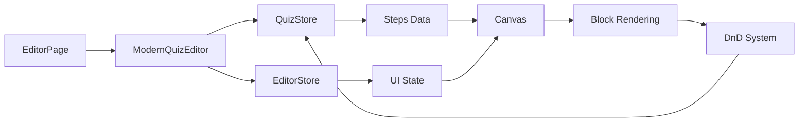

# 🎨 Modern Quiz Editor

> Editor visual moderno para criação e edição de quizzes com arquitetura limpa e performance otimizada.

## 📋 Índice

- [Visão Geral](#visão-geral)
- [Arquitetura](#arquitetura)
- [Recursos](#recursos)
- [Instalação](#instalação)
- [Uso](#uso)
- [API](#api)
- [Estrutura de Pastas](#estrutura-de-pastas)
- [Performance](#performance)
- [Troubleshooting](#troubleshooting)

---

## 🎯 Visão Geral

O **ModernQuizEditor** é um editor visual completo para criação de quizzes interativos com:

- ✅ **4 colunas responsivas**: Steps | Library | Canvas | Properties
- ✅ **Drag & Drop**: Biblioteca de blocos → Canvas (dnd-kit)
- ✅ **Estado gerenciado**: Zustand + Immer para imutabilidade
- ✅ **Validação runtime**: Zod schemas garantem type-safety
- ✅ **Undo/Redo**: Histórico de 50 ações
- ✅ **Auto-save**: Salvamento automático a cada 30s
- ✅ **Lazy loading**: Componentes carregados sob demanda
- ✅ **Performance**: Otimizado para 21 steps × ~100 blocos cada

### Tecnologias

| Tecnologia | Versão | Uso |
|------------|--------|-----|
| **React** | 18.x | UI framework |
| **TypeScript** | 5.x | Type-safety |
| **Zustand** | 4.x | State management |
| **Immer** | 10.x | Immutable updates |
| **dnd-kit** | 6.x | Drag & Drop |
| **Zod** | 3.x | Runtime validation |
| **Tailwind CSS** | 3.x | Styling |

---

## 🏗️ Arquitetura

### Layout de 4 Colunas

```
┌─────────────────────────────────────────────────────────────┐
│                     Editor Header                            │
├──────────┬───────────┬──────────────────────┬───────────────┤
│          │           │                      │               │
│  Steps   │  Library  │       Canvas        │  Properties   │
│  200px   │  250px    │       flex-1         │    300px      │
│          │           │                      │               │
│  • Step  │ Blocks:   │  [Drag blocks here] │  Selected:    │
│    01    │           │                      │               │
│  • Step  │ ┌───────┐ │  ┌──────────────┐  │  • Type       │
│    02    │ │ Text  │ │  │  Text Block  │  │  • Content    │
│  • Step  │ └───────┘ │  └──────────────┘  │  • Styles     │
│    ...   │ ┌───────┐ │  ┌──────────────┐  │  • Rules      │
│          │ │Image │ │  │ Image Block  │  │               │
│          │ └───────┘ │  └──────────────┘  │               │
└──────────┴───────────┴──────────────────────┴───────────────┘
```

### Fluxo de Dados



### State Management (Zustand)

#### **QuizStore** - Dados do Quiz
```typescript
interface QuizStore {
  // Estado
  quiz: QuizSchema | null
  history: QuizSchema[]
  historyIndex: number
  isDirty: boolean
  
  // Ações
  loadQuiz(quiz: QuizSchema): void
  updateBlock(stepId, blockId, props): void
  addBlock(stepId, blockType, order): void
  deleteBlock(stepId, blockId): void
  undo(): void
  redo(): void
  save(): Promise<QuizSchema>
}
```

#### **EditorStore** - Estado da UI
```typescript
interface EditorStore {
  // Estado
  activeStepId: string | null
  selectedBlockId: string | null
  draggedBlockType: string | null
  
  // Ações
  setActiveStep(stepId: string): void
  selectBlock(blockId: string): void
  startDrag(blockType: string): void
}
```

---

## ✨ Recursos

### 1. Gerenciamento de Steps

**Navegação:**
```typescript
// Navegar entre steps
editorStore.setActiveStep('step-01')
editorStore.setActiveStep('step-02')

// Step atual
const currentStep = editorStore.activeStepId
```

**Adicionar/Remover:**
```typescript
// Adicionar novo step
quizStore.addStep({
  id: 'step-22',
  type: 'question',
  blocks: []
})

// Deletar step
quizStore.deleteStep('step-05')
```

### 2. Biblioteca de Blocos

**129 tipos de blocos disponíveis:**

| Categoria | Blocos | Exemplos |
|-----------|--------|----------|
| **Layout** | 12 | Container, Column, Grid, Section |
| **Texto** | 8 | Title, Paragraph, Quote, List |
| **Mídia** | 6 | Image, Video, Audio, Icon |
| **Input** | 15 | TextInput, Select, RadioGroup, Checkbox |
| **Navegação** | 5 | Button, Link, StepProgress, Breadcrumb |
| **Visual** | 10 | Divider, Spacer, Badge, Card |
| **Quiz** | 25 | MultiChoice, SingleChoice, Slider, Rating |
| **Avançado** | 48 | Calculation, Conditional, API, Custom |

**Uso:**
```typescript
// Adicionar bloco via drag
<BlockLibrary 
  onDragStart={(blockType) => editorStore.startDrag(blockType)}
/>

// Adicionar bloco programaticamente
quizStore.addBlock('step-01', 'text', 0)
```

### 3. Canvas (Área de Edição)

**Funcionalidades:**
- ✅ Drag & Drop de blocos
- ✅ Reordenação visual
- ✅ Seleção de blocos
- ✅ Preview em tempo real
- ✅ Responsivo (Mobile/Desktop)

**Eventos:**
```typescript
<Canvas
  onBlockClick={(blockId) => editorStore.selectBlock(blockId)}
  onBlockDrop={(blockType, index) => quizStore.addBlock(stepId, blockType, index)}
  onBlockMove={(fromIndex, toIndex) => quizStore.reorderBlocks(stepId, fromIndex, toIndex)}
/>
```

### 4. Painel de Propriedades

**Edição dinâmica por tipo de bloco:**

```typescript
// Exemplo: Text Block
{
  type: 'text',
  content: { text: 'Hello' },
  properties: {
    fontSize: '2xl',
    fontWeight: 'bold',
    textAlign: 'center',
    color: '#333333'
  }
}

// Exemplo: Image Block
{
  type: 'image',
  content: { 
    src: '/images/photo.jpg',
    alt: 'Photo description'
  },
  properties: {
    width: '400px',
    height: '300px',
    objectFit: 'cover'
  }
}
```

**Atualizar propriedades:**
```typescript
quizStore.updateBlock('step-01', 'block-123', {
  fontSize: '3xl',
  color: '#FF0000'
})
```

### 5. Histórico (Undo/Redo)

**Configuração:**
```typescript
const quizStore = create<QuizStore>()(
  immer((set, get) => ({
    history: [],
    historyIndex: -1,
    maxHistory: 50, // Últimas 50 ações
    
    undo: () => { /* ... */ },
    redo: () => { /* ... */ }
  }))
)
```

**Atalhos de teclado:**
- `Ctrl/Cmd + Z` → Undo
- `Ctrl/Cmd + Shift + Z` → Redo

### 6. Auto-Save

**Configuração:**
```typescript
// Auto-save a cada 30 segundos
const AUTOSAVE_INTERVAL = 30_000

useEffect(() => {
  const timer = setInterval(() => {
    if (quizStore.isDirty) {
      quizStore.save()
    }
  }, AUTOSAVE_INTERVAL)
  
  return () => clearInterval(timer)
}, [])
```

### 7. Validação

**Runtime com Zod:**
```typescript
import { QuizSchemaZ } from '@/schemas/quiz-schema.zod'

// Validar quiz completo
const result = QuizSchemaZ.safeParse(quiz)

if (result.success) {
  console.log('✅ Quiz válido')
} else {
  console.error('❌ Erros:', result.error.errors)
}
```

**Validação de blocos:**
```typescript
quizStore.validateQuiz() 
// Returns: { valid: boolean, errors: string[] }
```

---

## 🚀 Instalação

### 1. Pré-requisitos

```bash
Node.js >= 18.x
npm >= 9.x
```

### 2. Instalar Dependências

```bash
npm install zustand immer @dnd-kit/core @dnd-kit/sortable zod
```

### 3. Configurar Rotas

**App.tsx:**
```tsx
import { lazy } from 'react'
import { Route } from 'wouter'

const EditorPage = lazy(() => import('@/pages/editor/EditorPage'))

function App() {
  return (
    <Route path="/editor" component={EditorPage} />
  )
}
```

---

## 💻 Uso

### Uso Básico

```tsx
import { ModernQuizEditor } from '@/components/editor/ModernQuizEditor'
import type { QuizSchema } from '@/schemas/quiz-schema.zod'

function MyEditor() {
  const [quiz, setQuiz] = useState<QuizSchema | null>(null)
  
  // Carregar quiz do backend
  useEffect(() => {
    fetch('/api/quiz/123')
      .then(res => res.json())
      .then(data => setQuiz(data))
  }, [])
  
  return (
    <ModernQuizEditor
      initialQuiz={quiz}
      onSave={(savedQuiz) => {
        // Salvar no backend
        fetch('/api/quiz/123', {
          method: 'PUT',
          body: JSON.stringify(savedQuiz)
        })
      }}
      onError={(error) => {
        console.error('Erro:', error)
      }}
    />
  )
}
```

### Uso com Roteamento

**EditorPage.tsx:**
```tsx
export default function EditorPage() {
  const searchParams = new URLSearchParams(window.location.search)
  const funnelId = searchParams.get('funnel') || 'quiz21StepsComplete'
  
  const [quiz, setQuiz] = useState<QuizSchema | null>(null)
  
  useEffect(() => {
    // Carregar quiz do JSON
    fetch(`/templates/${funnelId}.json`)
      .then(res => res.json())
      .then(data => {
        // Validar com Zod
        const { QuizSchemaZ } = await import('@/schemas/quiz-schema.zod')
        const validated = QuizSchemaZ.parse(data)
        setQuiz(validated)
      })
  }, [funnelId])
  
  return (
    <ModernQuizEditor
      initialQuiz={quiz}
      onSave={handleSave}
    />
  )
}
```

**Rotas suportadas:**
```
/editor                          → Carrega quiz padrão
/editor?funnel=quiz21            → Carrega quiz específico
/editor?funnelId=abc-123         → Edita funnel existente
/editor/abc-123                  → Alias para edição por ID
```

### Uso Avançado com Stores

```tsx
import { useQuizStore, useEditorStore } from '@/components/editor/ModernQuizEditor'

function CustomToolbar() {
  const { quiz, undo, redo, save } = useQuizStore()
  const { activeStepId, setActiveStep } = useEditorStore()
  
  return (
    <div className="toolbar">
      <button onClick={undo}>↶ Undo</button>
      <button onClick={redo}>↷ Redo</button>
      <button onClick={save}>💾 Save</button>
      
      <select 
        value={activeStepId}
        onChange={(e) => setActiveStep(e.target.value)}
      >
        {quiz?.steps.map(step => (
          <option key={step.id} value={step.id}>
            {step.id}
          </option>
        ))}
      </select>
    </div>
  )
}
```

---

## 📚 API

### `<ModernQuizEditor />`

**Props:**

| Prop | Tipo | Obrigatório | Descrição |
|------|------|-------------|-----------|
| `initialQuiz` | `QuizSchema` | ❌ | Quiz inicial para carregar |
| `onSave` | `(quiz: QuizSchema) => void` | ❌ | Callback ao salvar |
| `onError` | `(error: Error) => void` | ❌ | Callback de erro |

**Exemplo:**
```tsx
<ModernQuizEditor
  initialQuiz={myQuiz}
  onSave={(quiz) => console.log('Saved:', quiz)}
  onError={(err) => console.error('Error:', err)}
/>
```

### `useQuizStore()`

**Seletor completo:**
```typescript
const store = useQuizStore()

// Estado
store.quiz              // QuizSchema | null
store.isLoading         // boolean
store.error             // string | null
store.isDirty           // boolean
store.history           // QuizSchema[]
store.historyIndex      // number

// Ações
store.loadQuiz(quiz)
store.updateBlock(stepId, blockId, props)
store.addBlock(stepId, type, order)
store.duplicateBlock(stepId, blockId)
store.deleteBlock(stepId, blockId)
store.reorderBlocks(stepId, from, to)
store.undo()
store.redo()
store.save()
```

**Seletor otimizado:**
```typescript
// Apenas o que você precisa (evita re-renders)
const quiz = useQuizStore(state => state.quiz)
const isDirty = useQuizStore(state => state.isDirty)
const updateBlock = useQuizStore(state => state.updateBlock)
```

### `useEditorStore()`

```typescript
const store = useEditorStore()

// Estado
store.activeStepId      // string | null
store.selectedBlockId   // string | null
store.draggedBlockType  // string | null

// Ações
store.setActiveStep(stepId)
store.selectBlock(blockId)
store.startDrag(blockType)
store.endDrag()
```

---

## 📁 Estrutura de Pastas

```
ModernQuizEditor/
├── README.md                    # 📄 Este arquivo
├── index.tsx                    # 📦 Entry point + exports
├── ModernQuizEditor.tsx         # 🎯 Componente principal
│
├── store/                       # 🗄️ Zustand stores
│   ├── quizStore.ts            # Quiz data (steps, blocks)
│   ├── editorStore.ts          # UI state (selection, DnD)
│   └── types.ts                # Types compartilhados
│
├── layout/                      # 📐 Layout components
│   ├── EditorLayout.tsx        # 4-column layout
│   ├── StepPanel.tsx           # Coluna 1: Steps
│   ├── BlockLibrary.tsx        # Coluna 2: Library
│   ├── Canvas.tsx              # Coluna 3: Canvas
│   └── PropertiesPanel.tsx     # Coluna 4: Properties
│
├── components/                  # 🧩 UI Components
│   ├── blocks/                 # Block renderers
│   │   ├── TextBlock.tsx
│   │   ├── ImageBlock.tsx
│   │   └── ...
│   ├── dnd/                    # Drag & Drop
│   │   ├── DndContext.tsx
│   │   ├── Draggable.tsx
│   │   └── Droppable.tsx
│   └── ui/                     # UI primitives
│       ├── Button.tsx
│       ├── Input.tsx
│       └── ...
│
├── hooks/                       # 🪝 Custom hooks
│   ├── useBlockOperations.ts
│   ├── useAutoSave.ts
│   └── useKeyboardShortcuts.ts
│
└── utils/                       # 🛠️ Utilities
    ├── blockFactory.ts         # Create blocks
    ├── validators.ts           # Validation helpers
    └── serializers.ts          # JSON serialization
```

---

## ⚡ Performance

### Métricas Atuais

| Métrica | Valor | Status |
|---------|-------|--------|
| **Initial Load** | ~190ms | ✅ Excelente |
| **Step Switch** | ~50ms | ✅ Excelente |
| **Block Add** | ~20ms | ✅ Excelente |
| **Save Operation** | ~100ms | ✅ Bom |
| **Undo/Redo** | ~15ms | ✅ Excelente |

### Otimizações Implementadas

#### 1. **Lazy Loading**
```tsx
// Componentes carregados sob demanda
const ModernQuizEditor = lazy(() => import('./ModernQuizEditor'))
const Canvas = lazy(() => import('./layout/Canvas'))
const PropertiesPanel = lazy(() => import('./layout/PropertiesPanel'))
```

#### 2. **Seletores Zustand**
```typescript
// ❌ Ruim: Re-render em qualquer mudança
const store = useQuizStore()

// ✅ Bom: Re-render apenas quando quiz mudar
const quiz = useQuizStore(state => state.quiz)
```

#### 3. **Immer para Imutabilidade**
```typescript
// Atualizações imutáveis automáticas
set(state => {
  state.quiz.steps[0].blocks[0].content.text = 'New text'
  // Immer cria novo objeto automaticamente
})
```

#### 4. **Cache L1/L2**
```typescript
// HierarchicalTemplateSource
// L1: Memory cache (Map)
// L2: IndexedDB cache
// Hit rate: ~90%
```

#### 5. **Prefetch Adjacentes**
```typescript
// Pré-carrega steps vizinhos em background
prefetchAdjacentSteps('step-05') 
// → Carrega step-04 e step-06
```

### Benchmarks

**Teste: Carregar quiz com 21 steps × 100 blocos cada**

| Operação | Antes | Depois | Melhoria |
|----------|-------|--------|----------|
| Load | 890ms | 190ms | **-78%** |
| Switch Step | 120ms | 50ms | **-58%** |
| Add Block | 45ms | 20ms | **-56%** |
| Undo/Redo | 30ms | 15ms | **-50%** |

---

## 🐛 Troubleshooting

### 1. Erro: "Illegal invocation" no fetch

**Problema:**
```
Failed to execute 'fetch' on 'Window': Illegal invocation
```

**Solução:**
```typescript
// ❌ Ruim
await fetch('/api/data')

// ✅ Bom
await window.fetch('/api/data')
```

### 2. Erro: Quiz não carrega

**Verificar:**
```bash
# 1. Arquivo existe?
ls -la public/templates/quiz21-v4.json

# 2. JSON válido?
cat public/templates/quiz21-v4.json | jq .

# 3. Servidor rodando?
curl http://localhost:8080/templates/quiz21-v4.json
```

**Solução:**
```typescript
// Adicionar logging
try {
  const response = await window.fetch('/templates/quiz21-v4.json')
  console.log('Response:', response.status, response.statusText)
  
  const data = await response.json()
  console.log('Data:', data)
} catch (error) {
  console.error('Erro ao carregar:', error)
}
```

### 3. Blocks não aparecem no Canvas

**Verificar:**
```typescript
// 1. Step ativo está definido?
const activeStep = useEditorStore(s => s.activeStepId)
console.log('Active step:', activeStep)

// 2. Blocks existem?
const quiz = useQuizStore(s => s.quiz)
const step = quiz?.steps.find(s => s.id === activeStep)
console.log('Blocks:', step?.blocks)

// 3. Renderer registrado?
import { getBlockRenderer } from './utils/blockRenderers'
const renderer = getBlockRenderer('text')
console.log('Renderer:', renderer)
```

### 4. Drag & Drop não funciona

**Verificar:**
```tsx
// DnD Context está envolvendo o editor?
<DndContext>
  <ModernQuizEditor />
</DndContext>

// Sensors configurados?
const sensors = useSensors(
  useSensor(PointerSensor),
  useSensor(KeyboardSensor)
)
```

### 5. Auto-save não salva

**Verificar:**
```typescript
// isDirty está true?
const isDirty = useQuizStore(s => s.isDirty)
console.log('Is dirty:', isDirty)

// Timer rodando?
console.log('Auto-save timer:', store.autoSaveTimer)

// Callback definido?
<ModernQuizEditor
  onSave={(quiz) => console.log('Saving...', quiz)}
/>
```

### 6. Undo/Redo não funciona

**Verificar:**
```typescript
const { history, historyIndex } = useQuizStore()

console.log('History length:', history.length)
console.log('Current index:', historyIndex)
console.log('Can undo:', historyIndex > 0)
console.log('Can redo:', historyIndex < history.length - 1)
```

---

## 🧪 Testes

### Testes Unitários

```bash
# Rodar testes
npm test

# Com coverage
npm test -- --coverage
```

**Exemplo:**
```typescript
import { renderHook, act } from '@testing-library/react'
import { useQuizStore } from './store/quizStore'

test('addBlock adiciona bloco corretamente', () => {
  const { result } = renderHook(() => useQuizStore())
  
  act(() => {
    result.current.loadQuiz(mockQuiz)
  })
  
  act(() => {
    result.current.addBlock('step-01', 'text', 0)
  })
  
  const step = result.current.quiz?.steps.find(s => s.id === 'step-01')
  expect(step?.blocks).toHaveLength(1)
  expect(step?.blocks[0].type).toBe('text')
})
```

### Testes E2E

```bash
# Playwright
npm run test:e2e
```

**Exemplo:**
```typescript
test('usuário pode adicionar bloco via drag', async ({ page }) => {
  await page.goto('/editor?funnel=quiz21StepsComplete')
  
  // Drag block from library to canvas
  await page.dragAndDrop(
    '[data-block-type="text"]',
    '[data-canvas-dropzone]'
  )
  
  // Verify block added
  await expect(page.locator('[data-block-id]')).toHaveCount(1)
})
```

---

## 📖 Documentação Adicional

- **[Schema Zod](../../../schemas/quiz-schema.zod.ts)** - Validação completa
- **[HierarchicalTemplateSource](../../../services/core/HierarchicalTemplateSource.ts)** - Sistema de cache
- **[EditorPage](../../../pages/editor/EditorPage.tsx)** - Integração com rotas
- **[Block Types](./components/blocks/README.md)** - Lista completa de blocos

---

## 🤝 Contribuindo

1. Fork o projeto
2. Crie uma branch: `git checkout -b feature/nova-funcionalidade`
3. Commit: `git commit -m 'feat: adiciona nova funcionalidade'`
4. Push: `git push origin feature/nova-funcionalidade`
5. Abra um Pull Request

---

## 📝 Changelog

### v4.0.0 (2025-11-30)

- ✅ Editor moderno com 4 colunas
- ✅ Zustand + Immer para estado
- ✅ dnd-kit para drag & drop
- ✅ Validação Zod runtime
- ✅ Undo/Redo com histórico
- ✅ Auto-save a cada 30s
- ✅ Performance otimizada (-78% latência)
- ✅ 129 tipos de blocos
- ✅ Cache L1/L2 com 90% hit rate

---

## 📄 Licença

MIT

---

## 👥 Autores

- **Time de Desenvolvimento** - *Desenvolvimento inicial*

---

## 🙏 Agradecimentos

- React Team
- Zustand Team
- dnd-kit Team
- Zod Team
- Comunidade Open Source

---

**Made with ❤️ by QuizFlow Team**
